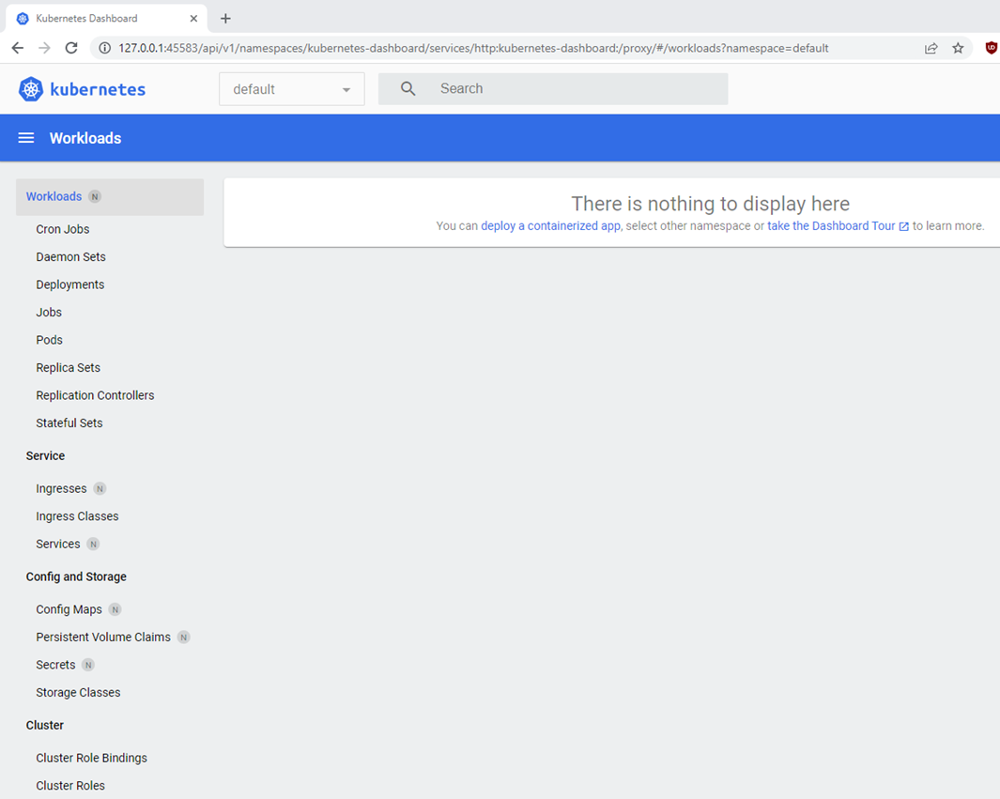
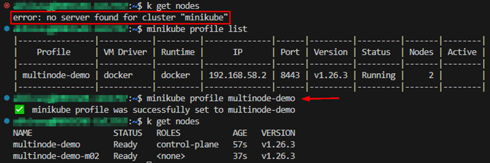

## LAB: Docker and Minikube in WSL2 Ubuntu

* [WSL2](#wsl2)
* [Install Docker in WSL2 Ubuntu](#docker)
* [Install minikube in WSL2 Ubuntu](#minikube)

### WSL2 <a name="wsl2"></a>

* Enable WSL2
* Install Ubuntu distribution of Linux

Ref: [Install Linux on Windows with WSL](https://learn.microsoft.com/en-us/windows/wsl/install)

Open PowerShell or Windows Command Prompt in administrator mode by right-clicking and selecting "Run as administrator", enter the wsl --install command, then restart your machine.

```
wsl --install
```

**systemd - wsl.conf**

Ref: [Systemd support is now available in WSL!](https://devblogs.microsoft.com/commandline/systemd-support-is-now-available-in-wsl/)

Set the systemd flag set in your WSL distro settings, if it’s not there already.
Add these lines to the `/etc/wsl.conf` (you’ll need to run your editor with sudo privileges)

```
[boot]
systemd=true
```

Close your WSL distro Windows and run `wsl.exe --shutdown` from PowerShell to restart your WSL instances.

**limit memory usage – .wslconfig**

Ref: [Advanced settings configuration in WSL](https://learn.microsoft.com/en-us/windows/wsl/wsl-config)

Create an empty `.wslconfig` file at `C:\Users\<UserName>\`

Add the following text to this file (only shown for illustrative purposes). Restart wsl.

```
# Settings apply across all Linux distros running on WSL 2
[wsl2]

# Limits VM memory to use no more than 4 GB, this can be set as whole numbers using GB or MB
memory=4GB 

# Sets the VM to use two virtual processors
processors=2
```

---

### Install Docker in WSL2 Ubuntu <a name="docker"></a>

Ref: [Install Docker Engine on Ubuntu](https://docs.docker.com/engine/install/ubuntu/)

**Uninstall old versions**

```console
$ sudo apt-get remove docker docker-engine docker.io containerd runc
[sudo] password for abhinavg:
Reading package lists... Done
Building dependency tree... Done
Reading state information... Done
E: Unable to locate package docker-engine
```

**Install using the apt repository**

1. Update the apt package index and install packages to allow apt to use a repository over HTTPS:

```
$ sudo apt-get update
Hit:1 http://security.ubuntu.com/ubuntu jammy-security InRelease            tes curl gnupg
Hit:2 http://archive.ubuntu.com/ubuntu jammy InRelease
Hit:3 http://archive.ubuntu.com/ubuntu jammy-updates InRelease
Hit:4 http://archive.ubuntu.com/ubuntu jammy-backports InRelease
```

```
$ sudo apt-get install ca-certificates curl gnupg
Reading package lists... Done
Building dependency tree... Done
Reading state information... Done
ca-certificates is already the newest version (20211016ubuntu0.22.04.1).
ca-certificates set to manually installed.
curl is already the newest version (7.81.0-1ubuntu1.10).
curl set to manually installed.
gnupg is already the newest version (2.2.27-3ubuntu2.1).
gnupg set to manually installed.
0 upgraded, 0 newly installed, 0 to remove and 4 not upgraded.
```

2. Add Docker’s official GPG key:

```
$ sudo install -m 0755 -d /etc/apt/keyrings
$ curl -fsSL https://download.docker.com/linux/ubuntu/gpg | sudo gpg --dearmor -o /etc/apt/keyrings/docker.gpg
$ sudo chmod a+r /etc/apt/keyrings/docker.gpg
```

3. Use the following command to set up the repository:

```
$ echo \
  "deb [arch="$(dpkg --print-architecture)" signed-by=/etc/apt/keyrings/docker.gpg] https://download.docker.com/linux/ubuntu \
  "$(. /etc/os-release && echo "$VERSION_CODENAME")" stable" | \
  sudo tee /etc/apt/sources.list.d/docker.list > /dev/null
```

**Install Docker Engine**

1. Update the apt package index:

```
$ sudo apt-get update
Hit:1 http://archive.ubuntu.com/ubuntu jammy InRelease
Hit:2 http://archive.ubuntu.com/ubuntu jammy-updates InRelease
Hit:3 http://archive.ubuntu.com/ubuntu jammy-backports InRelease
Hit:4 http://security.ubuntu.com/ubuntu jammy-security InRelease
Get:5 https://download.docker.com/linux/ubuntu jammy InRelease [48.9 kB]
Get:6 https://download.docker.com/linux/ubuntu jammy/stable amd64 Packages [17.5 kB]
Fetched 66.4 kB in 1s (63.5 kB/s)
Reading package lists... Done
```

2. Install Docker Engine, containerd, and Docker Compose.

```
$ sudo apt-get install docker-ce docker-ce-cli containerd.io docker-buildx-plugin docker-compose-plugin
```

3. Verify that the Docker Engine installation is successful by running the hello-world image using the following command `$ sudo docker run hello-world`

**Linux post-installation steps for Docker Engine**

Ref: [Linux post-installation steps for Docker Engine](https://docs.docker.com/engine/install/linux-postinstall/)

Without sudo you’ll get an error as shown below.
```
$ docker images
permission denied while trying to connect to the Docker daemon socket at unix:///var/run/docker.sock: Get "http://%2Fvar%2Frun%2Fdocker.sock/v1.24/images/json": dial unix /var/run/docker.sock: connect: permission denied
```

The Docker daemon binds to a Unix socket, not a TCP port. By default, it’s the `root` user that owns the Unix socket, and other users can only access it using `sudo`. The Docker daemon always runs as the `root` user.

If you don’t want to preface the `docker` command with `sudo`, create a Unix group called `docker` and add users to it. When the Docker daemon starts, it creates a Unix socket accessible by members of the `docker` group. On some Linux distributions, the system automatically creates this group when installing Docker Engine using a package manager. In that case, there is no need for you to manually create the group.

Check if docker group exists.
```
$ cat /etc/group | grep docker
docker:x:999:
```

You can also use getent command.
```
$ getent group docker
docker:x:999:
```

See which groups your user account belongs to in Linux, run the `groups` command. You can also run `groups <username>` command.

```
$ groups
abhinavg adm dialout cdrom floppy sudo audio dip video plugdev netdev
```

1. Create the docker group.

```
$ sudo groupadd docker
[sudo] password for abhinavg:
groupadd: group 'docker' already exists
```

2. Add your user to the docker group.

```
$ sudo usermod -aG docker $USER

$ groups abhinavg
abhinavg : abhinavg adm dialout cdrom floppy sudo audio dip video plugdev netdev docker
```

3. Log out and log back in so that your group membership is re-evaluated.

4. Verify that you can run docker commands without sudo `$ docker run hello-world`

**Configure Docker to start on boot with systemd**  
Refer link.

**Configure default logging driver**  
Refer link.

---

### Install minikube in WSL2 Ubuntu <a name="minikube"></a>

Ref: https://minikube.sigs.k8s.io/docs/start/

**Install and start minikube cluster**

1. Installation on Linux.

```
$ curl -LO https://storage.googleapis.com/minikube/releases/latest/minikube-linux-amd64
  % Total    % Received % Xferd  Average Speed   Time    Time     Time  Current
                                 Dload  Upload   Total   Spent    Left  Speed
100 80.0M  100 80.0M    0     0  25.8M      0  0:00:03  0:00:03 --:--:-- 25.8M

$ sudo install minikube-linux-amd64 /usr/local/bin/minikube
```

2. Start your cluster.  
From a terminal with administrator access (but not logged in as root), run:

```
$ minikube start
😄  minikube v1.30.1 on Ubuntu 22.04 (amd64)
✨  Automatically selected the docker driver. Other choices: none, ssh
📌  Using Docker driver with root privileges
👍  Starting control plane node minikube in cluster minikube
🚜  Pulling base image ...
💾  Downloading Kubernetes v1.26.3 preload ...
    > preloaded-images-k8s-v18-v1...:  397.02 MiB / 397.02 MiB  100.00% 14.13 M
    > gcr.io/k8s-minikube/kicbase...:  373.53 MiB / 373.53 MiB  100.00% 12.35 M
🔥  Creating docker container (CPUs=2, Memory=3900MB) ...
🐳  Preparing Kubernetes v1.26.3 on Docker 23.0.2 ...
    ▪ Generating certificates and keys ...
    ▪ Booting up control plane ...
    ▪ Configuring RBAC rules ...
🔗  Configuring bridge CNI (Container Networking Interface) ...
    ▪ Using image gcr.io/k8s-minikube/storage-provisioner:v5
🔎  Verifying Kubernetes components...
🌟  Enabled addons: storage-provisioner, default-storageclass
💡  kubectl not found. If you need it, try: 'minikube kubectl -- get pods -A'
🏄  Done! kubectl is now configured to use "minikube" cluster and "default" namespace by default
```

3. Interact with your cluster.  
`minikube` can download the appropriate version of `kubectl` and you should be able to use it like this:

```
$ minikube kubectl -- get po -A
    > kubectl.sha256:  64 B / 64 B [-------------------------] 100.00% ? p/s 0s
    > kubectl:  45.81 MiB / 45.81 MiB [------------] 100.00% 28.70 MiB p/s 1.8s
NAMESPACE     NAME                               READY   STATUS    RESTARTS   AGE
kube-system   coredns-787d4945fb-jmb4m           1/1     Running   0          3m52s
kube-system   etcd-minikube                      1/1     Running   0          4m3s
kube-system   kube-apiserver-minikube            1/1     Running   0          4m3s
kube-system   kube-controller-manager-minikube   1/1     Running   0          4m3s
kube-system   kube-proxy-hxw9w                   1/1     Running   0          3m52s
kube-system   kube-scheduler-minikube            1/1     Running   0          4m4s
kube-system   storage-provisioner                1/1     Running   0          4m1s
```

4. Add alias to your shell config.  
You may want to put all your additions into a separate file like `~/.bash_aliases`, instead of adding them to `.bashrc` directly.

```bash
alias kubectl="minikube kubectl --"
alias k="kubectl"
alias m="minikube"
```

You can verify these aliases using `alias` command.

By default, `minikube start` creates a cluster named “minikube”. If you would like to create a different cluster or change its name, you can use the `--profile` (or `-p`) flag, which will create a cluster with the specified name.

To see the list of your current clusters, run:

```
$ minikube profile list
|----------|-----------|---------|--------------|------|---------|---------|-------|--------|
| Profile  | VM Driver | Runtime |      IP      | Port | Version | Status  | Nodes | Active |
|----------|-----------|---------|--------------|------|---------|---------|-------|--------|
| minikube | docker    | docker  | 192.168.49.2 | 8443 | v1.26.3 | Running |     1 | *      |
|----------|-----------|---------|--------------|------|---------|---------|-------|--------|
```

**Minikube dashboard**

Ref: https://minikube.sigs.k8s.io/docs/handbook/dashboard/

minikube has integrated support for the Kubernetes Dashboard UI.

To access the dashboard:
```
$ minikube dashboard
🤔  Verifying dashboard health ...
🚀  Launching proxy ...
🤔  Verifying proxy health ...
🎉  Opening http://127.0.0.1:45583/api/v1/namespaces/kubernetes-dashboard/services/http:kubernetes-dashboard:/proxy/ in your default browser...
👉  http://127.0.0.1:45583/api/v1/namespaces/kubernetes-dashboard/services/http:kubernetes-dashboard:/proxy/
```

Open the URL in a browser.



**Multi-node Clusters**

Ref: https://minikube.sigs.k8s.io/docs/tutorials/multi_node/

Start a cluster with 2 nodes.

```
$ minikube start --nodes 2 -p multinode-demo

😄  [multinode-demo] minikube v1.30.1 on Ubuntu 22.04 (amd64)
✨  Automatically selected the docker driver
📌  Using Docker driver with root privileges
👍  Starting control plane node multinode-demo in cluster multinode-demo
🚜  Pulling base image ...
🔥  Creating docker container (CPUs=2, Memory=2200MB) ...
🐳  Preparing Kubernetes v1.26.3 on Docker 23.0.2 ...
    ▪ Generating certificates and keys ...
    ▪ Booting up control plane ...
    ▪ Configuring RBAC rules ...
🔗  Configuring CNI (Container Networking Interface) ...
    ▪ Using image gcr.io/k8s-minikube/storage-provisioner:v5
🔎  Verifying Kubernetes components...
🌟  Enabled addons: storage-provisioner, default-storageclass

👍  Starting worker node multinode-demo-m02 in cluster multinode-demo
🚜  Pulling base image ...
🔥  Creating docker container (CPUs=2, Memory=2200MB) ...
🌐  Found network options:
    ▪ NO_PROXY=192.168.58.2
🐳  Preparing Kubernetes v1.26.3 on Docker 23.0.2 ...
    ▪ env NO_PROXY=192.168.58.2
🔎  Verifying Kubernetes components...
💡  kubectl not found. If you need it, try: 'minikube kubectl -- get pods -A'
🏄  Done! kubectl is now configured to use "multinode-demo" cluster and "default" namespace by default
```

Get a list of your nodes.
```
$ kubectl get nodes
```

**Note:** You need to set the profile to the newly created profile, else above command will not show the nodes from this new cluster.



**Delete and recreate cluster**

```
$ minikube delete --all
🔥  Deleting "minikube" in docker ...
🔥  Removing /home/abhinavg/.minikube/machines/minikube ...
💀  Removed all traces of the "minikube" cluster.
🔥  Successfully deleted all profiles

$ minikube start
😄  minikube v1.30.1 on Ubuntu 22.04 (amd64)
✨  Automatically selected the docker driver
📌  Using Docker driver with root privileges
👍  Starting control plane node minikube in cluster minikube
🚜  Pulling base image ...
🔥  Creating docker container (CPUs=2, Memory=2200MB) ...
🐳  Preparing Kubernetes v1.26.3 on Docker 23.0.2 ...
    ▪ Generating certificates and keys ...
    ▪ Booting up control plane ...
    ▪ Configuring RBAC rules ...
🔗  Configuring bridge CNI (Container Networking Interface) ...
    ▪ Using image gcr.io/k8s-minikube/storage-provisioner:v5
🔎  Verifying Kubernetes components...
🌟  Enabled addons: storage-provisioner, default-storageclass
💡  kubectl not found. If you need it, try: 'minikube kubectl -- get pods -A'
🏄  Done! kubectl is now configured to use "minikube" cluster and "default" namespace by default
```

**Multiple clusters: Minikube profiles**

In Minikube, you can create and manage multiple clusters by utilizing different profiles. Each profile represents a distinct Minikube cluster with its own configuration settings.

To switch between different Minikube clusters (profiles), use the following command:
`minikube profile <profile-name>`

Examples:  
Start dev cluster with 2 nodes:
`minikube start --nodes 2 -p devcluster`

Start prod cluster with 3 nodes:
`minikube start --nodes 3 -p prodcluster`

```
$ minikube profile list
|-------------|-----------|---------|--------------|------|---------|---------|-------|--------|
|   Profile   | VM Driver | Runtime |      IP      | Port | Version | Status  | Nodes | Active |
|-------------|-----------|---------|--------------|------|---------|---------|-------|--------|
| devcluster  | docker    | docker  | 192.168.49.2 | 8443 | v1.26.3 | Running |     2 |        |
| prodcluster | docker    | docker  | 192.168.58.2 | 8443 | v1.26.3 | Running |     3 | *      |
|-------------|-----------|---------|--------------|------|---------|---------|-------|--------|
```

Switch to dev cluster. This will make the dev cluster active.
```
$ minikube profile devcluster
✅  minikube profile was successfully set to devcluster
```

Verify current cluster.
```
$ kubectl config current-context
devcluster
```

Verify kubectl command runs against the active cluster.
```
$ kubectl get nodes
NAME             STATUS   ROLES           AGE   VERSION
devcluster       Ready    control-plane   14m   v1.26.3
devcluster-m02   Ready    <none>          14m   v1.26.3
```

Later, you will see how to create custom namespaces in a cluster and create resources in that custom namespace.


