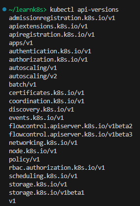
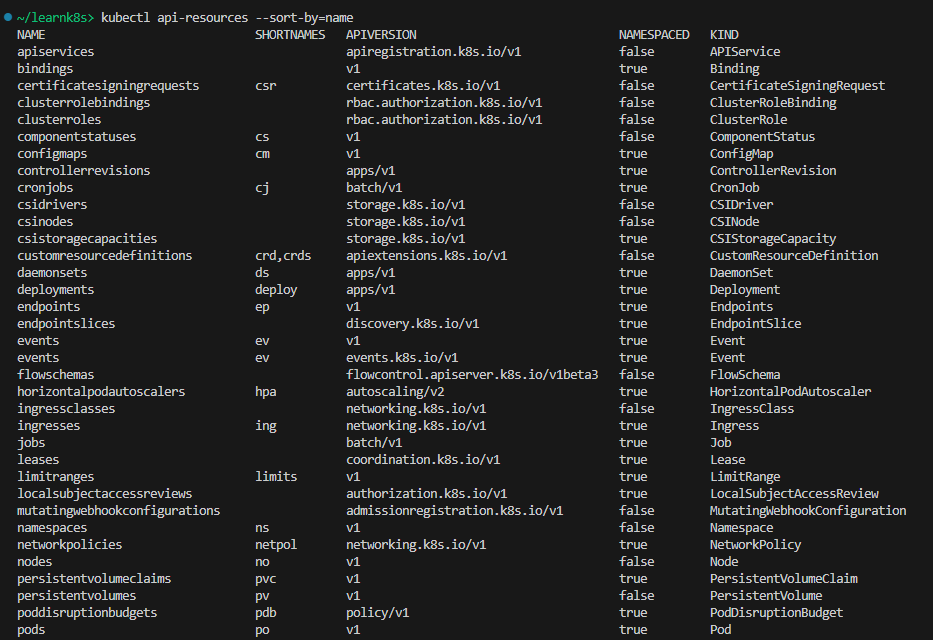
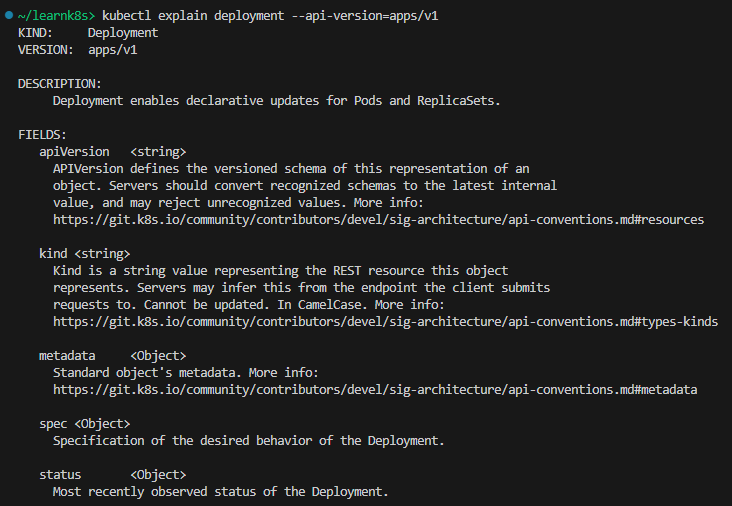

## Kubernetes Object Management

Ref: [Kubernetes Object Management](https://kubernetes.io/docs/concepts/overview/working-with-objects/object-management/)

The `kubectl` command-line tool supports several different ways to create and manage Kubernetes objects.

**Imperative commands**
* A user operates directly on live objects in a cluster. The user provides operations to the `kubectl` command as arguments or flags.
* It provides no history of previous configurations.
* Example: [Run an instance of the nginx container by creating a Deployment object](02-k8s-lab-kubectl.md#kubectl-imperative) using `kubectl create deployment` command.
* Commands do not provide a template for creating new objects.
* You specify the exact commands to be executed to achieve a specific state. For example, you may use the `kubectl run` command to create a Pod directly.

**Declarative object configuration**
* A user operates on object configuration files stored locally, however the user does not define the operations to be taken on the files. Create, update, and delete operations are automatically detected per-object by `kubectl`.
* The declarative approach involves declaring the desired state of your resources in a configuration file, such as a YAML file. You use tools like `kubectl apply` to apply the configuration file to the cluster. Kubernetes then automatically reconciles the actual state with the desired state defined in the configuration.
* Example: Save the following YAML file, and then run `kubectl apply -f YAML_FILE_NAME` 

    ```yaml
    apiVersion: apps/v1
    kind: Deployment # create Deployment object
    metadata:
    name: nginx-deployment # name of the Deployment
    labels: # manage pods with label and also manage ReplicaSet
        app: nginx
    spec: # spec of desired behavior of the Deployment
    replicas: 2 # number of desired pods. Also create ReplicaSet.   
    selector:
        matchLabels: # ReplicaSet will manage pods that have label app: nginx
        app: nginx
    template:
        metadata:
        labels: # assign a label to the pod
            app: nginx
        spec: # spec of desired behavior of the pod
        containers: # list of containers belonging to the pod
        - name: nginx # container name
            image: nginx:latest # Docker image name
            resources:
            limits:
                memory: "128Mi"
                cpu: "500m"
            ports:
            - containerPort: 80
    ```
* `kubectl apply -f <directory>` can be used to create all objects, except those that already exist, defined by configuration files in a specified directory.  
This sets the `kubectl.kubernetes.io/last-applied-configuration: '{...}'` annotation on each object. The annotation contains the contents of the object configuration file that was used to create the object.  
Add the `-R` flag to recursively process directories.  

**Useful info when creating / updating manifest files**  
`kubectl api-versions` - Print the supported API versions.  



`kubectl api-resources` - Print the supported API resources. This information is useful when working with manifest files. It allows you to determine the `apiVersion` associated with a specific `Kind`.  For example, the `Deployment` resource has an `apiVersion` of `apps/v1`.  



To describe the fields associated with each supported API resource, you can utilize the `kubectl explain` command. For instance, running `kubectl explain deployment --api-version=apps/v1` will provide the relevant output.  


