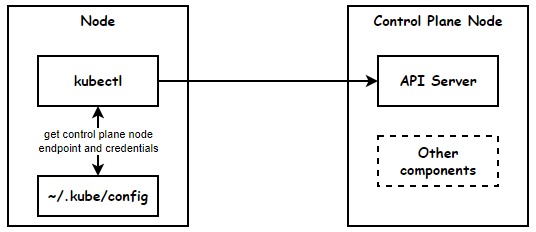

## Kubeconfig

Ref: [Organizing Cluster Access Using kubeconfig Files](https://kubernetes.io/docs/concepts/configuration/organize-cluster-access-kubeconfig/)



A file that is used to configure access to clusters is called a *kubeconfig* file. With kubeconfig files, you can organize your clusters, users, and namespaces. You can also define contexts to quickly and easily switch between clusters and namespaces.

By default, kubectl looks for kubeconfig in this location `$HOME/.kube/config`.
You can use `kubectl config view` to see the contents of this file.

You can specify other kubeconfig files by setting the `KUBECONFIG` environment variable or by setting the `--kubeconfig` flag.

Following is a sample kubeconfig file from a minikube installation.

```yaml
apiVersion: v1
clusters:
- cluster:
    certificate-authority: /home/username/.minikube/ca.crt
    extensions:
    - extension:
        last-update: Wed, 24 May 2023 15:30:49 CDT
        provider: minikube.sigs.k8s.io
        version: v1.30.1
      name: cluster_info
    server: https://127.0.0.1:32819
  name: multinode
contexts:
- context:
    cluster: multinode
    extensions:
    - extension:
        last-update: Wed, 24 May 2023 15:30:49 CDT
        provider: minikube.sigs.k8s.io
        version: v1.30.1
      name: context_info
    namespace: default
    user: multinode
  name: multinode
current-context: multinode
kind: Config
preferences: {}
users:
- name: multinode
  user:
    client-certificate: /home/username/.minikube/profiles/multinode/client.crt
    client-key: /home/username/.minikube/profiles/multinode/client.key

```