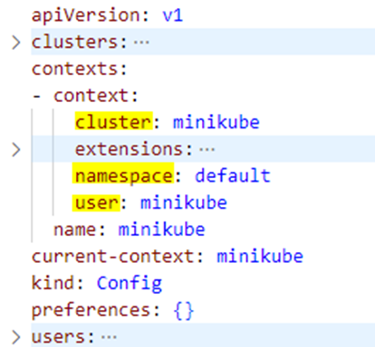
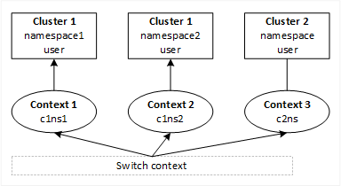

## Kubernetes Context

References:  
[Kubectl config set-context tutorial](https://www.airplane.dev/blog/kubectl-config-set-context-tutorial-and-best-practices)  
[Configure Access to Multiple Clusters](https://kubernetes.io/docs/tasks/access-application-cluster/configure-access-multiple-clusters/)  
[stackoverflow: What is the difference between namespaces and contexts in Kubernetes](https://stackoverflow.com/questions/61171487/what-is-the-difference-between-namespaces-and-contexts-in-kubernetes)  

A *context* element in a kubeconfig file is used to group access parameters under a convenient name. Each context has three parameters: cluster, namespace, and user. By default, the `kubectl` command-line tool uses parameters from the *current context* to communicate with the cluster.

In Kubernetes, a context is like a profile or a configuration setting that helps you manage your connection to different Kubernetes clusters.

Set the current-context in kubeconfig file using `kubectl config use-context CONTEXT_NAME`

Imagine you have multiple Kubernetes clusters, each representing a separate environment such as development, staging, and production. Each cluster has its own unique location (like a physical address) and requires specific authentication details (like a username and password) to access it.

Instead of manually entering all these connection details every time you want to work with a specific cluster, Kubernetes allows you to create a context. A context is a way to group all the necessary information for connecting to a cluster under a single, easy-to-remember name.

For example, you can create a context called "Development Cluster" that includes the location of the development cluster, the authentication details needed to access it, and other settings like the default namespace (a way to organize resources within a cluster).

With contexts, you can switch between different clusters or environments seamlessly. Instead of dealing with complex connection details, you simply switch to the desired context. It's like selecting a preconfigured profile that sets up everything for you.

So, contexts make it easier for you to manage and interact with multiple Kubernetes clusters by providing a more human-friendlier and convenient way to switch between them.

