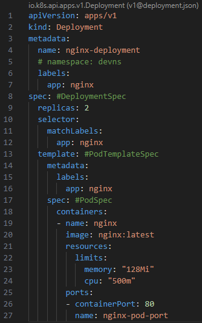
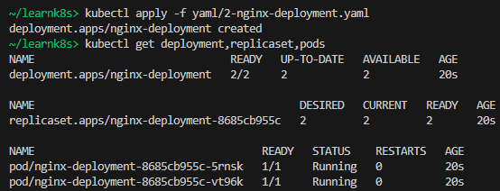
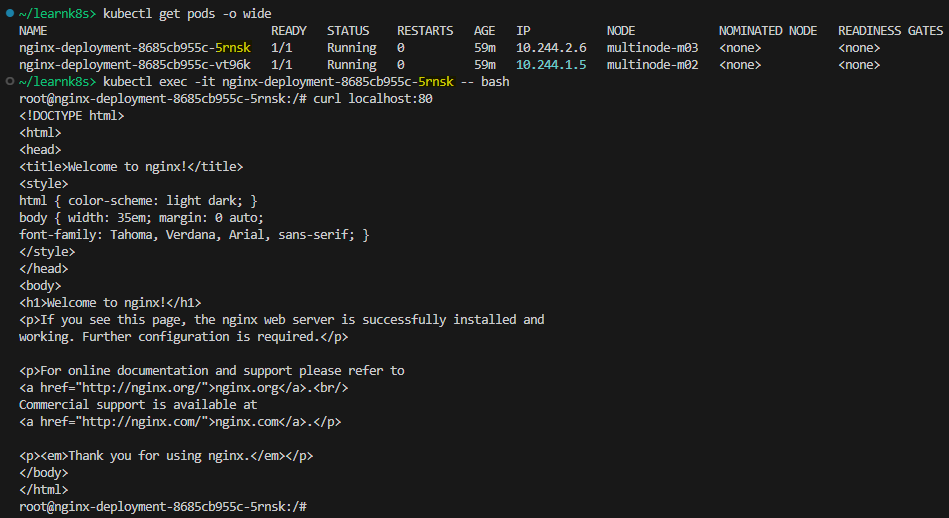
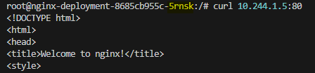
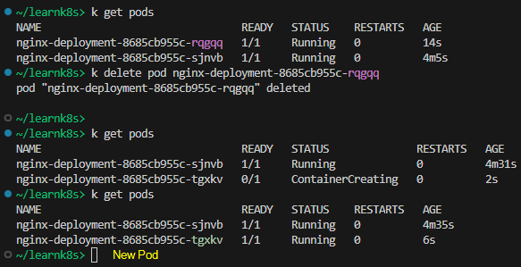
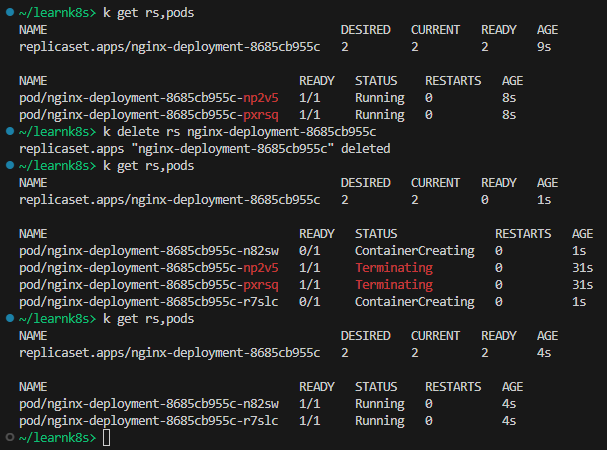
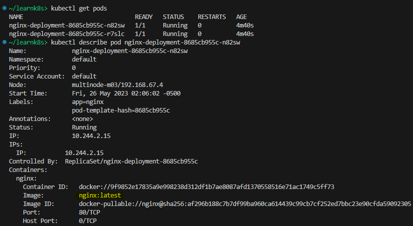
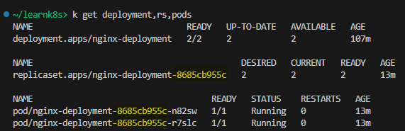
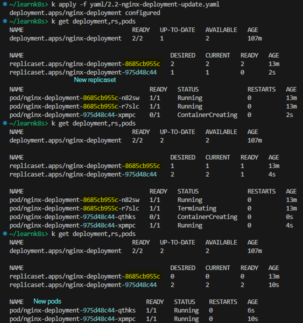
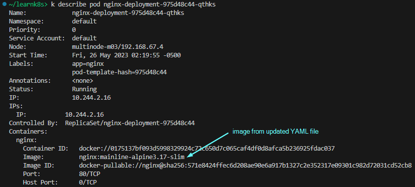

## Deployment

Ref: [Kubernetes API: Deployment](https://kubernetes.io/docs/reference/kubernetes-api/workload-resources/deployment-v1/)

**Agenda**
* Create a Deployment with 2 Pods.
* Access app from outside the cluster.
* Access app from within the Pod.
* Access pod-2 from pod-1.
* Delete one pod. Observe Pod replacement.
* Delete ReplicaSet. Observe ReplicaSet and Pods restore.
* Describe a resource.
* Update Deployment.

> Start a Kubernetes cluster using `minikube start`.

Save the following YAML file in your directory.  
File: [2-nginx-deployment.yaml](yaml/2-nginx-deployment.yaml)

Create a Deployment using `kubectl apply -f YAML_FILE`. This will create Pods managed by a ReplicaSet managed by a Deployment.

Try to access this app by using `curl localhost:80`. You’ll get connection refused.

***Note:***  minikube creates a vm and then runs your containers on it.   
Run `minikube ssh` to connect to the minikube vm and then try to access your app using `curl localhost:80`.

Now, attach a shell to one of the pods, and then try again. This time you’ll get the proper output.

While inside the shell of one of the Pods, try to access the app on the other Pod using the other Pod’s IP address.

***Lesson*** – by default there is no external access to the Pods. However, Pods can interact with each other using their internal IP address. To enable external access, another K8s object called Service can be used.

**Delete a Pod**

Delete one of the pods using `kubectl delete pod POD_NAME`. When a Pod is deleted, the ReplicaSet will automatically spin up a new Pod.

**Delete ReplicaSet**

Use the command `kubectl delete rs RS_NAME` to delete the ReplicaSet. If the ReplicaSet is deleted, the Deployment will restore it with the same name as before, as long as there are running Pods. Additionally, it will terminate the old Pods and create new Pods as needed.

**Describe a Resource**

`kubectl describe RESOURCE_TYPE RESOURCE_NAME` – get information about the object such as a Pod, ReplicaSet, Deployment etc.

**Update Docker image tag and apply new Deployment**

Update nginx image in the Deployment YAML file and run `kubectl apply -f YAML_FILE` again. New ReplicaSet and new Pods will be created in this instance.

File: [2.2-nginx-deployment-update.yaml](yaml/2.2-nginx-deployment-update.yaml)

*Before `kubectl apply`*  

*After `kubectl apply`*  

**Cleanup**  
Run `kubectl delete -f YAML_FILE`.
