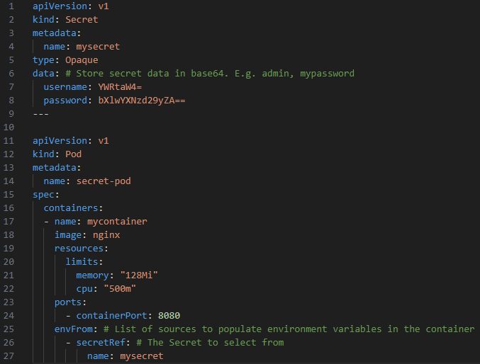

## Configure all key-value pairs in a Secret as container environment variables

References:  
[Configure all key-value pairs in a Secret as container environment variables](https://kubernetes.io/docs/tasks/inject-data-application/distribute-credentials-secure/#configure-all-key-value-pairs-in-a-secret-as-container-environment-variables)   

**Agenda**
* Background.  
* Create a Secret and a Pod that uses the Secret as container environment variables.  
* Cleanup.

> Start a Kubernetes cluster using `minikube start`.


Secrets can be mounted as data volumes or exposed as environment variables to be used by a container in a Pod.  

**Create Secret and Pod that uses the secret using config file**  
The manifest file used in this lab has Secret and Pod configuration in the same file separated by `---` in YAML.  

Create a Secret containing multiple key-value pairs. For e.g.  
name: mysecret  
data: username=_admin_, password=_mypassword_ in base64.  

Pod:  
Uses Secret as env variables.  

Create the manifest. Save the following YAML file in your directory.  
File: [8-k8s-secret-env-2.yaml](yaml/8-k8s-secret-env-2.yaml)



Apply the configuration using using `kubectl apply -f YAML_FILE`.  

```console
~/learnk8s> kubectl apply -f yaml/8-k8s-secret-env-2.yaml 
secret/mysecret created
pod/secret-pod created
```

In your shell, display the contents of container environment variables.  

```console
~/learnk8s> kubectl exec -it secret-pod -- /bin/sh -c 'echo "username: $username\npassword: $password\n"'
username: admin
password: mypassword
```

**Cleanup**  
Delete the configuration using `kubectl delete -f YAML_FILE`.

```console
~/learnk8s> kubectl delete -f yaml/8-k8s-secret-env-2.yaml 
secret "mysecret" deleted
pod "secret-pod" deleted
```