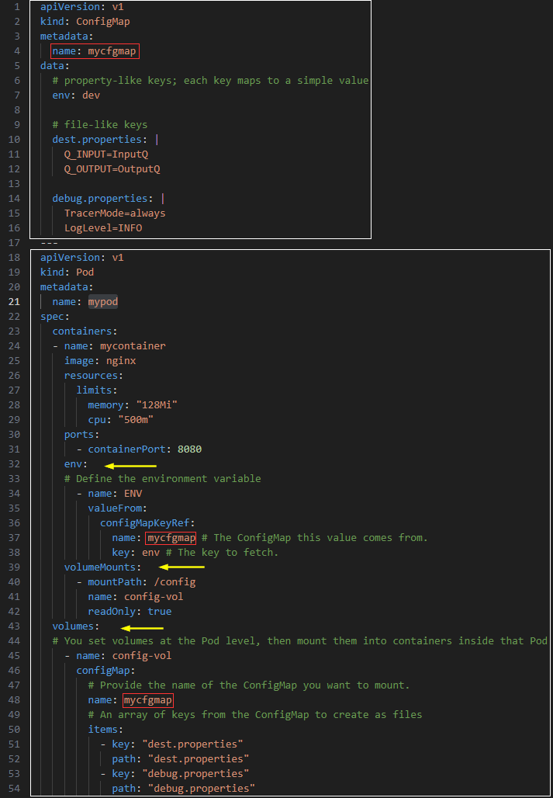

## ConfigMap

References:  
[ConfigMaps](https://kubernetes.io/docs/concepts/configuration/configmap/)  
[Kubernetes API: ConfigMap](https://kubernetes.io/docs/reference/kubernetes-api/config-and-storage-resources/config-map-v1/)  

**Agenda**
* Overview.
* Create a ConfigMap and a Pod that uses this ConfigMap.
* Cleanup.

> Start a Kubernetes cluster using `minikube start`.

**Background**  
A ConfigMap is an API object used to store non-confidential data in key-value pairs. Pods can consume ConfigMaps as environment variables, command-line arguments, or as configuration files in a volume.  
A ConfigMap allows you to decouple environment-specific configuration from your container images, so that your applications are easily portable.  

**Create ConfigMap and Pod using config file**  

Create the manifest. Save the following YAML file in your directory.  
File: [10-k8s-configmap-env-vol.yaml](yaml/10-k8s-configmap-env-vol.yaml)



Apply the configuration using `kubectl apply -f YAML_FILE`.  

```console
~/learnk8s> kubectl apply -f yaml/10-k8s-configmap-env-vol.yaml 
configmap/mycfgmap created
pod/mypod created
```

**Verification**  

Get a shell to the Pod.  

```console
~/learnk8s> kubectl exec -i -t mypod -- /bin/bash
```

Run the commands as shown below.  
```console
root@mypod:/# pwd
/
root@mypod:/# ls
bin  boot  config  dev  docker-entrypoint.d  docker-entrypoint.sh  etc  home  lib  lib64  media  mnt  opt  proc  root  run  sbin  srv  sys  tmp  usr  var
root@mypod:/# echo $ENV
dev
root@mypod:/# cd config/
root@mypod:/config# ls
debug.properties  dest.properties
root@mypod:/config# cat dest.properties 
Q_INPUT=InputQ
Q_OUTPUT=OutputQ
root@mypod:/config# cat debug.properties 
TracerMode=always
LogLevel=INFO
root@mypod:/config# exit
exit
~/learnk8s>
```

**Cleanup**  
Delete the configuration using `kubectl delete -f YAML_FILE`.

```console
~/learnk8s> kubectl delete -f yaml/10-k8s-configmap-env-vol.yaml 
configmap "mycfgmap" deleted
pod "mypod" deleted
```