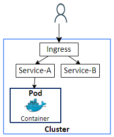
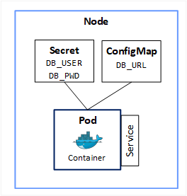
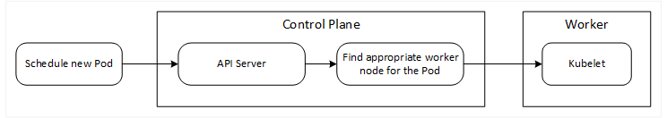

# Kubernetes 101
## **Concepts**
- [Introduction](#introduction)
    - [Understanding Kubernetes (K8s) using an analogy](#analogy)
    - [Sample Use-Cases](#use-cases)
    - [Desired state](#desired-state)
- [Concepts](#concepts)
    - [Node](#node)
    - [Cluster](#cluster)
    - [Pod](#pod)
    - [Service](#service)
    - [Ingress](#ingress)
    - [ConfigMap and Secret](#cfgmap-secret)
    - [Data Storage](#storage)
    - [Deployment](#deployment)
    - [StatefulSet](#statefulset)
    - [Namespaces](#namespaces)
- [Kubernetes Architecture](#architecture)
    - [Control Plane Components](#control-plane)
        - [API Server](#apiserver)
        - [Scheduler](#scheduler)
        - [Controller Manager](#controller-manager)
        - [etcd](#etcd)
    - [Node Components](#node-components)
        - [Container Runtime](#container-runtime)
        - [Kubelet](#kubelet)
        - [Kube-proxy](#kube-proxy)
---

## **Labs**
- [LAB: Docker and Minikube in WSL2 Ubuntu](k8s-lab-install-docker-minikube.md)
- [LAB: Basic kubectl commands](k8s-lab-kubectl.md)
- [Imperative vs Declarative](k8s-imperative-declarative.md)
- [Kubeconfig](k8s-kubeconfig.md)
- [Kubernetes Context](k8s-context.md)
- [LAB: namespaces](k8s-lab-namespaces.md)
- [LAB: Deployment](k8s-lab-deployment.md)
- [LAB: Service](k8s-lab-service.md)
- [LAB: Volumes - emptyDir](k8s-lab-volumes-emptydir.md)
- [LAB: Volumes - hostPath](k8s-lab-volumes-hostpath.md)
- [LAB: Secrets](k8s-lab-secrets.md)
- [LAB: Using Secrets as environment variables - env](k8s-lab-secrets-usage-env-1.md)
- [LAB: Using Secrets as environment variables - envFrom](k8s-lab-secrets-usage-env-2.md)
- [LAB: Using Secrets as volumes](k8s-lab-secrets-usage-vol.md)
- [LAB: ConfigMap](k8s-lab-configmap.md)
---

## Introduction 

Kubernetes is an open-source container orchestration platform that automates the deployment, scaling, and management of applications.
It provides a scalable and resilient infrastructure for running containerized applications across a cluster of machines.

**Analogy** 

Imagine Kubernetes as a smart conductor that manages a group of computers (called a cluster) to work together smoothly. It takes care of distributing applications, making sure they run reliably, and scaling them up or down when needed. It's like having a team of workers that automatically handle tasks and fix problems, allowing you to focus on your applications without worrying about the underlying infrastructure.

**Sample use-cases to understand Kubernetes concepts** 

* Start 3 containers using a given Docker image e.g. nginx:latest.
* Place a load balancer in front of these containers.
* Scale up – add more machines and add more containers.
* Replace existing containers with new image e.g. nginx:1.24. Do a rolling upgrade to minimize downtime.
* Scale down.
* When a container fails, create a new container and assign it to a machine in the cluster.

**Desired State**   

[Desired state](https://kubernetes.io/docs/concepts/architecture/controller/) in Kubernetes means defining how you want your applications and infrastructure to look and behave. It's like giving a clear instruction manual to Kubernetes, specifying the number of instances, resource configurations, and behaviors you desire. Kubernetes then takes care of continuously adjusting and maintaining the system to match that desired state, ensuring everything runs smoothly as intended.  

As an example, let's consider a scenario where our objective is to deploy three instances of our application, each running in its own container and distributed across three separate machines. This is the desired state we want to achieve. Kubernetes ensures that we consistently maintain this desired state, even when faced with interruptions. For example, if one container were to stop unexpectedly, Kubernetes would automatically start a new container to replace it. Similarly, in the event of a machine failure, Kubernetes would spin up a replacement machine to ensure uninterrupted operation.    

--- 

## Concepts 

**Node** 
* Physical or virtual machine where Kubernetes is installed.
* **Worker** machine.
 * Containers are hosted on worker nodes.

**Control Plane**
* Manages the worker nodes.
* Responsible for actual orchestration of containers on the worker nodes.

**Cluster**   
When you deploy Kubernetes, you get a cluster. A Kubernetes cluster consists of a set of worker machines, called nodes, that run containerized applications. Every cluster has at least one worker node. [Kubernetes Architecture](#architecture) section provides additional details on Kubernetes components.

**Pod** 

* Kubernetes doesn’t deploy containers directly on the worker nodes.
* Containers are encapsulated into a Kubernetes object known as a Pod. 
* A Pod is a group of one or more containers, with shared storage/network resources. Think of a Pod as a wrapper around a single container. This abstraction is done so you can use any container runtime and not just Docker.
* Each Pod is meant to run a single instance of a given application. If you want to scale your application horizontally (i.e. more instances), you should use multiple Pods, one for each instance. In Kubernetes, this is referred to as replication.
* Each Pod gets its own internal IP address. A Pod gets a new IP address on re-creation.

**Service** 

* Pods can communicate with each other using their internal IP addresses, but are not accessible from outside the cluster.
* Services provide external access to applications running inside Pods and can span multiple nodes.
* _NodePort_ services map a port on the node to a port on the Pod, enabling external access.
* Services use labels to select Pods across nodes, offering flexibility in routing traffic.
* Services stay available with the same IP address, even if a Pod goes down.
* Services act as load-balancers, evenly distributing traffic to Pods.

**Ingress** 

* Services in a cluster handle external access to applications and ensure load balancing.
* Instead of directly accessing a service, requests first go to the ingress, which then forwards them to the appropriate service.

**ConfigMap and Secret** 

* Decouple environment-specific configuration from container images. E.g. env properties like database urls, credentials etc.
* ConfigMap is used to store non-confidential data in key-value pairs.
* Secret is used to store sensitive information such as passwords, OAuth tokens, and ssh keys.
* Pods can consume ConfigMaps as environment variables, command-line arguments, or as configuration files in a volume.
* Secrets can be mounted as data volumes or exposed as environment variables to be used by a container in a Pod.

**Data Storage** 

* Persist data from the container so it is not lost when container / pod is restarted.
* Volume attaches physical storage to a Pod.
* Storage can be on a local machine or outside of the Kubernetes cluster.

**Deployment** 

* Desired state is defined in a Deployment, which represents a group of identical Pods. Deployment is an abstraction layer on top of Pods.
* Deployments manage multiple replicas of your application and automatically replace any failed or unresponsive instances, ensuring the actual state matches the desired state.
* Replicas of the application are connected to the same Service, which provides a static IP address and acts as a load balancer.

**StatefulSet** 

* Stateful applications, such as databases, can't be replicated using Deployments alone.
* StatefulSets handle the replication and autoscaling of pods, ensuring database consistency by synchronizing reads and writes.
* Databases are commonly hosted externally, outside the Kubernetes cluster.

**Namespaces** 

In Kubernetes, namespaces are a way to logically divide and organize resources within a cluster. They provide a virtual separation of resources, allowing different teams, projects, or applications to coexist within the same Kubernetes cluster without interfering with each other.

Think of namespaces as virtual partitions or compartments within a shared Kubernetes environment. They help prevent naming collisions and provide isolation between different sets of resources.

--- 

## Kubernetes Architecture 

Ref: [Kubernetes Components](https://kubernetes.io/docs/concepts/overview/components/)

**Control Plane Components** 
- **API Server** 
    * Exposes the Kubernetes API.
    * Front end for the Kubernetes control plane
    * Users, CLI talk to the API Server to interact with the Kubernetes cluster.

- **Scheduler** 
    
    

    The scheduler determines which Node in the cluster a new Pod should be placed on.
    Process that actually starts the Pod on the Node is the kubelet.

- **Controller Manager** 
    
    The controller manager detects changes in the state of the cluster, such as when nodes or pods become unavailable. In response to these changes, the controller manager requests the scheduler to reallocate or reschedule the affected pods to ensure they are running on available nodes.

- **etcd** 
    * etcd is the distributed, reliable key-value store used by Kubernetes to store all data used to manage the cluster.
    * It functions as the "database" of Kubernetes, storing crucial information about the cluster's current status.
    * etcd's data is utilized in Kubernetes' self-healing capability, facilitating the transition from the current state to the desired state.
    * etcd does not store application data. It focuses on storing and managing the operational data required for Kubernetes itself.

**Node Components** 

- **Container Runtime** 
    * The container runtime is the software that is responsible for running containers.
    * Kubernetes supports container runtimes such as containerd, CRI-O, and any other implementation of the [Kubernetes CRI (Container Runtime Interface)](https://github.com/kubernetes/community/blob/master/contributors/devel/sig-node/container-runtime-interface.md).

- **Kubelet** 
    * An agent that runs on each node in the cluster. It makes sure that containers are running in a Pod.
    * It communicates with both the container runtime and the node. It listens for instructions from the kube-apiserver.
    * The kubelet is responsible for initiating the start of a pod and its associated container.
    * It assigns the necessary resources from the node to the container, ensuring the container has what it needs to run smoothly.

- **Kube-proxy** 
    * kube-proxy is a network proxy that runs on each node in your cluster, implementing part of the Kubernetes Service concept.
    * Kube-proxy enables network communication to your Pods from network sessions inside or outside of your cluster.
    * When available, kube-proxy utilizes the operating system's packet filtering layer. If unavailable, it directly forwards the network traffic itself.

