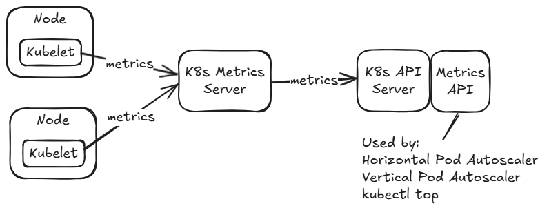
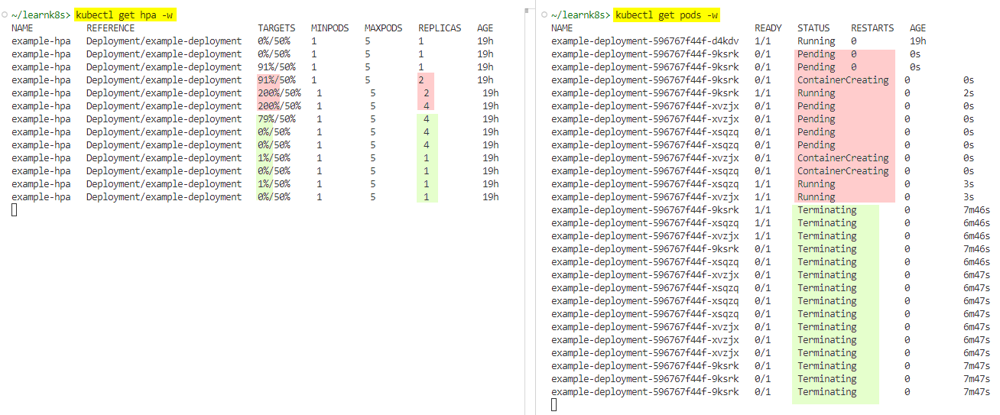

# Horizontal Pod Autoscaling and Resources Requests / Limits

## Agenda
* **[Horizontal Pod Autoscaling](#k8shpa)**
* **[Understanding resources requests and limits](#k8sresources)**
---

## Horizontal Pod Autoscaling <a name="k8shpa"></a>

Ref: https://kubernetes.io/docs/tasks/run-application/horizontal-pod-autoscale/  
Ref: https://kubernetes.io/docs/tasks/run-application/horizontal-pod-autoscale-walkthrough/

### What is Kubernetes (K8s) Horizontal Pod Autoscaler (HPA)?

The Horizontal Pod Autoscaler (HPA) is a feature in Kubernetes that automatically adjusts the number of pods in a deployment based on the current resource usage, such as CPU or memory.

### How does it work in Kubernetes?

1. You set a target CPU utilization for your deployment. For example, you say, “Each pod should use around 50% of its requested CPU.”
2. Kubernetes monitors the actual CPU usage of your pods.
3. If the CPU usage is consistently higher than 50%, Kubernetes adds more pods to handle the load.
4. If CPU usage drops below 50%, Kubernetes reduces the number of pods.

### Metrics Server

[Metrics Server](https://github.com/kubernetes-sigs/metrics-server#readme) collects resource metrics from Kubelets and exposes them in Kubernetes apiserver through Metrics API for use by Horizontal Pod Autoscaler and Vertical Pod Autoscaler. Metrics API can also be accessed by `kubectl top`.



Run the following command to enable metrics-server in Minikube:  
`minikube addons enable metrics-server`

You can run `minikube addons list` to list all available minikube addons as well as their current statuses (enabled/disabled).

```
~/learnk8s> minikube addons list
|-----------------------------|----------|--------------|--------------------------------|
|         ADDON NAME          | PROFILE  |    STATUS    |           MAINTAINER           |
|-----------------------------|----------|--------------|--------------------------------|
| ambassador                  | minikube | disabled     | 3rd party (Ambassador)         |
| auto-pause                  | minikube | disabled     | minikube                       |
| cloud-spanner               | minikube | disabled     | Google                         |
| csi-hostpath-driver         | minikube | disabled     | Kubernetes                     |
| dashboard                   | minikube | disabled     | Kubernetes                     |
| default-storageclass        | minikube | enabled ✅   | Kubernetes                     |
| efk                         | minikube | disabled     | 3rd party (Elastic)            |
| freshpod                    | minikube | disabled     | Google                         |
| gcp-auth                    | minikube | disabled     | Google                         |
| gvisor                      | minikube | disabled     | minikube                       |
| headlamp                    | minikube | disabled     | 3rd party (kinvolk.io)         |
| helm-tiller                 | minikube | disabled     | 3rd party (Helm)               |
| inaccel                     | minikube | disabled     | 3rd party (InAccel             |
|                             |          |              | [info@inaccel.com])            |
| ingress                     | minikube | disabled     | Kubernetes                     |
| ingress-dns                 | minikube | disabled     | minikube                       |
| inspektor-gadget            | minikube | disabled     | 3rd party                      |
|                             |          |              | (inspektor-gadget.io)          |
| istio                       | minikube | disabled     | 3rd party (Istio)              |
| istio-provisioner           | minikube | disabled     | 3rd party (Istio)              |
| kong                        | minikube | disabled     | 3rd party (Kong HQ)            |
| kubeflow                    | minikube | disabled     | 3rd party                      |
| kubevirt                    | minikube | disabled     | 3rd party (KubeVirt)           |
| logviewer                   | minikube | disabled     | 3rd party (unknown)            |
| metallb                     | minikube | disabled     | 3rd party (MetalLB)            |
| metrics-server              | minikube | disabled     | Kubernetes                     |
| nvidia-device-plugin        | minikube | disabled     | 3rd party (NVIDIA)             |
| nvidia-driver-installer     | minikube | disabled     | 3rd party (Nvidia)             |
| nvidia-gpu-device-plugin    | minikube | disabled     | 3rd party (Nvidia)             |
| olm                         | minikube | disabled     | 3rd party (Operator Framework) |
| pod-security-policy         | minikube | disabled     | 3rd party (unknown)            |
| portainer                   | minikube | disabled     | 3rd party (Portainer.io)       |
| registry                    | minikube | disabled     | minikube                       |
| registry-aliases            | minikube | disabled     | 3rd party (unknown)            |
| registry-creds              | minikube | disabled     | 3rd party (UPMC Enterprises)   |
| storage-provisioner         | minikube | enabled ✅   | minikube                       |
| storage-provisioner-gluster | minikube | disabled     | 3rd party (Gluster)            |
| storage-provisioner-rancher | minikube | disabled     | 3rd party (Rancher)            |
| volumesnapshots             | minikube | disabled     | Kubernetes                     |
|-----------------------------|----------|--------------|--------------------------------|
```

```console
~/learnk8s> minikube addons enable metrics-server
💡  metrics-server is an addon maintained by Kubernetes. For any concerns contact minikube on GitHub.
You can view the list of minikube maintainers at: https://github.com/kubernetes/minikube/blob/master/OWNERS
    ▪ Using image registry.k8s.io/metrics-server/metrics-server:v0.6.4
🌟  The 'metrics-server' addon is enabled
```

### Step-by-Step Example

****Step 1: Apply the Deployment and HPA****

1. **Create a Deployment**. Save the Deployment YAML to hpademo-deployment.yaml.

```yaml
apiVersion: apps/v1
kind: Deployment
metadata:
  name: example-deployment
spec:
  replicas: 1
  selector:
    matchLabels:
      app: example
  template:
    metadata:
      labels:
        app: example
    spec:
      containers:
      - name: example-app
        image: nginx:alpine
        resources:
          requests:
            cpu: 100m
          limits:
            cpu: 200m
            memory: 128Mi
```

Refer [Understanding resources requests and limits](#k8sresources) section to understand `resources` section in the K8s manifest.

2. **Create an HPA**: Next, you create an HPA that targets this deployment and scales based on CPU utilization. Save the HPA YAML to hpademo-hpa.yaml.

```yaml
apiVersion: autoscaling/v2
kind: HorizontalPodAutoscaler
metadata:
  name: example-hpa
spec:
  scaleTargetRef:
    apiVersion: apps/v1
    kind: Deployment
    name: example-deployment
  minReplicas: 1
  maxReplicas: 5
  metrics:
  - type: Resource
    resource:
      name: cpu
      target:
        type: Utilization
        averageUtilization: 50  # Target 50% of requested CPU
```

* **scaleTargetRef** specifies the deployment to scale.
* **minReplicas** and **maxReplicas** define the minimum and maximum number of pods.
* **averageUtilization**: Target CPU utilization (50% in this case).

3. Apply both manifests using `kubectl apply`.

```console
~/learnk8s/hpa> kubectl apply -f hpademo-deployment.yaml 
deployment.apps/example-deployment created

~/learnk8s/hpa> kubectl apply -f hpademo-hpa.yaml 
horizontalpodautoscaler.autoscaling/example-hpa created
```

Kubernetes will monitor the example-deployment and dynamically adjust the number of pods using the HPA as traffic and CPU utilization change.

4. Verify that the resources have been created.

```console
~/learnk8s> kubectl get deployments
NAME                 READY   UP-TO-DATE   AVAILABLE   AGE
example-deployment   1/1     1            1           19h

~/learnk8s> kubectl get hpa
NAME          REFERENCE                       TARGETS   MINPODS   MAXPODS   REPLICAS   AGE
example-hpa   Deployment/example-deployment   0%/50%    1         5         1          19h

~/learnk8s> kubectl get pods
NAME                                  READY   STATUS    RESTARTS   AGE
example-deployment-596767f44f-d4kdv   1/1     Running   0          19h
```

****Step 2: Observe the Current State****

1. **Check HPA Status** using `kubectl describe hpa`.

Look for:
* **Current utilization**: How much CPU the pod is currently using.
* **Desired replicas**: Number of pods that the HPA thinks are needed.

```console
~/learnk8s> kubectl describe hpa example-hpa
Name:                                                  example-hpa
Namespace:                                             default
Labels:                                                <none>
Annotations:                                           <none>
CreationTimestamp:                                     Thu, 12 Dec 2024 16:49:48 -0600
Reference:                                             Deployment/example-deployment
Metrics:                                               ( current / target )
  resource cpu on pods  (as a percentage of request):  0% (0) / 50%
Min replicas:                                          1
Max replicas:                                          5
Deployment pods:                                       1 current / 1 desired
Conditions:
  Type            Status  Reason            Message
  ----            ------  ------            -------
  AbleToScale     True    ReadyForNewScale  recommended size matches current size
  ScalingActive   True    ValidMetricFound  the HPA was able to successfully calculate a replica count from cpu resource utilization (percentage of request)
  ScalingLimited  True    TooFewReplicas    the desired replica count is less than the minimum replica count
Events:           <none>
```

2. **Check Pod Utilization** using `kubectl top pods`.

This shows CPU and memory usage for each pod.

```console
~/learnk8s> kubectl top pods
NAME                                  CPU(cores)   MEMORY(bytes)   
example-deployment-596767f44f-d4kdv   0m           3Mi
```

**Step 3: Simulate Load**

To test scaling, simulate CPU load on the pod.

1. Connect to the running pod using `kubectl exec -it <pod-name> -- /bin/sh`

```console
~/learnk8s> kubectl exec -it example-deployment-596767f44f-d4kdv -- /bin/sh
```

2. Run a CPU-intensive command:

```console
yes > /dev/null
```
This command keeps the CPU busy by generating a continuous stream of output. It will push CPU usage to 100%.

**Step 4: Monitor Scaling**

1. **Watch HPA Behavior** using `kubectl get hpa -w`.

Observe the changes in current utilization and desired replicas.

2. **Watch Pods Scaling** using `kubectl get pods -w`.

See if new pods are being created as the load increases.

**Step 5: Reduce Load**

1. Stop the CPU-intensive command in the pod using `killall <process-name>` or `pkill` etc. and `exit` .

2. Watch the HPA scale down as the CPU usage decreases:

```console
kubectl get hpa -w
kubectl get pods -w
```


**Cleanup**

Delete the configuration using `kubectl delete -f YAML_FILE`.

```console
~/learnk8s/hpa/hpademo-yaml> kubectl delete -f hpademo-hpa.yaml 
horizontalpodautoscaler.autoscaling "example-hpa" deleted
~/learnk8s/hpa/hpademo-yaml> kubectl delete -f hpademo-deployment.yaml 
deployment.apps "example-deployment" deleted
~/learnk8s/hpa/hpademo-yaml> kubectl get deployments
No resources found in default namespace.
~/learnk8s/hpa/hpademo-yaml> kubectl get hpa
No resources found in default namespace.
---

## Understanding resources requests and limits <a name="k8sresources"></a>

The resources section in Kubernetes is used to define the **CPU** and **memory** resources a container can use. It consists of two parts: **requests** and **limits**.

Example YAML:

```yaml
resources:
  requests:
    cpu: 100m         # Minimum 100 millicores of CPU (10% of 1 CPU core)
    memory: 256Mi     # Minimum 256 MiB of memory
  limits:
    cpu: 200m         # Maximum 200 millicores of CPU (20% of 1 CPU core)
    memory: 512Mi     # Maximum 512 MiB of memory

```

**What are Requests?**

* **Request** is the **minimum amount of CPU or memory** a container is guaranteed to get.
* Think of it like reserving a table at a restaurant: You request a table for 2 people. Even if the restaurant is busy, you are guaranteed this reservation.
* In Kubernetes, the scheduler ensures there is enough capacity on a node to satisfy the request before placing your pod there.

**What are Limits?**

* **Limit** is the **maximum amount of CPU or memory** a container is allowed to use.
* Think of it like a buffet:
* Even though you can eat as much as you like, there’s a limit on how much food you can take at one time.
* In Kubernetes, if the container tries to exceed the limit, it is either throttled (CPU) or killed (memory).

**How Requests and Limits Work Together**

* **Requests** guarantee resources to your container.
* **Limits** ensure the container doesn’t use too much and affect other applications.

**Difference between a CPU request and CPU utilization, and how this relates to the Horizontal Pod Autoscaler (HPA)**

1. **What CPU Requests Actually Mean**

* **CPU requests** define how much CPU is guaranteed for the pod. Kubernetes uses this value to schedule the pod on a node that has enough available resources.
* The **utilization percentage** used by HPA is relative to the **requested CPU**, not the full capacity of the node or the total CPU limit.

**Example:**  
* A pod requests 100m CPU (10% of one CPU core).
* Kubernetes ensures that this pod gets at least 100m CPU when it needs it.
* However, the pod may not always use the full 100m CPU. It might use only 50m CPU or even less if the workload is light.

2. **How CPU Utilization Works with Requests**

* **Utilization** is a measure of how much CPU the pod is actually using compared to its requested amount.

**Formula:**  
`Utilization (%) = (Current CPU usage / CPU request) * 100`

**Example**:
* If a pod requests 100m CPU:
* When the pod is using 50m CPU, its utilization is 50%.
* When the pod is using 100m CPU, its utilization is 100%.

This utilization percentage is what HPA monitors to decide whether to scale the pods up or down.

3. **How HPA Works with CPU Requests**

When you configure the HPA, you specify a target CPU utilization percentage relative to the CPU requests.

**Example:**  
* Suppose your deployment has:
* A pod with a CPU request of 100m.
* The HPA target utilization is 50%.
* If the pod uses:
* 50m CPU: Utilization is 50%. No scaling is triggered.
* 80m CPU: Utilization is 80%. HPA scales up (adds more pods).
* 30m CPU: Utilization is 30%. HPA might scale down (remove pods).

4. **Why Requests Aren’t 100% Utilization**

Requests are just **reservations**, not fixed allocations. A pod can use less than its requested CPU when it doesn’t need the full amount. The HPA observes this usage to determine if scaling is needed.
