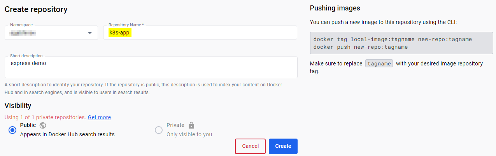
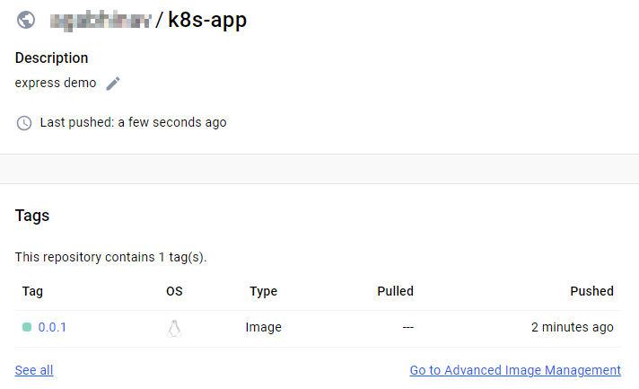

## Running an Express App in Kubernetes
### PART-2: Containerize an Application

**Agenda**
* Containerize a simple application.
* Push docker image to a container registry.

**Containerize an Application**  

Create a `Dockerfile` in `myapp` directory.

```dockerfile
FROM node:slim

WORKDIR /myapp

COPY package*.json .

RUN npm install

COPY app.js .

CMD [ "node", "app.js" ]

EXPOSE 3000
```

Build docker image.

```
~/learnk8s/k8s-app/myapp> docker build -t my-express-app .

~/learnk8s/k8s-app/myapp> docker images
REPOSITORY                    TAG       IMAGE ID       CREATED              SIZE
my-express-app                latest    fe7d31d67701   About a minute ago   259MB
```

Run the container locally.

```
~/learnk8s/k8s-app/myapp> docker run -p 3000:3000 my-express-app
Example app listening on port 3000
8a7e331ae341
172.17.0.2
```

Load http://localhost:3000/ in a browser to see the output.

---

**Push image to Docker Hub** 

Login to Docker Hub.  
Create a new repository. I am creating a public repo for this demo.



Before you can push the image to Docker Hub, you'll have to rebuild the image using the naming convention shown on Docker Hub. `docker push YOUR_DOCKERHUB_ACCOUNT/REPO_NAME:tagname`

```
~/learnk8s/k8s-app/myapp> docker build -t YOUR_DOCKERHUB_ACCOUNT/k8s-app:0.0.1 .
```

Make sure you can connect to Docker Hub from command line. Else, you'll get an error `requested access to the resource is denied` when trying to push an image.  

```
~/learnk8s/k8s-app/myapp> docker login
Login with your Docker ID to push and pull images from Docker Hub. If you don't have a Docker ID, head over to https://hub.docker.com to create one.
Username: YOUR_DOCKERHUB_USERNAME
Password: 
...

Login Succeeded
~/learnk8s/k8s-app/myapp> 
```

**Push the image to Docker Hub.**

```
~/learnk8s/k8s-app/myapp> docker push YOUR_DOCKERHUB_ACCOUNT/k8s-app:0.0.1
The push refers to repository [docker.io/YOUR_DOCKERHUB_ACCOUNT/k8s-app]
```

Verify the image on Docker Hub.

