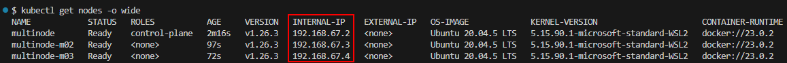
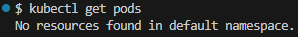
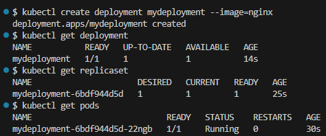
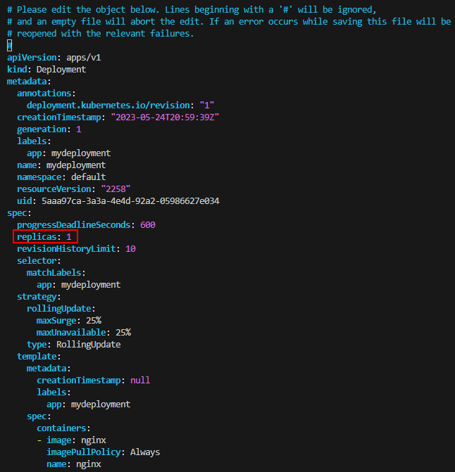
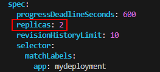
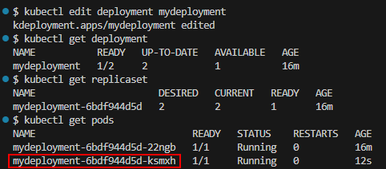
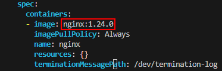
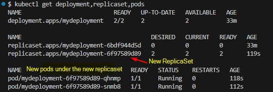
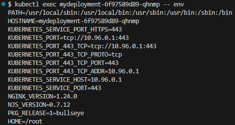

## Basic kubectl commands

Ref: [kubectl Cheat Sheet](https://kubernetes.io/docs/reference/kubectl/cheatsheet/)

`kubectl` is the CLI used to deploy and manage applications on a Kubernetes cluster, to get cluster info, to get status of other nodes in the cluster etc.

>Setup: Create a cluster with 3 nodes.  
>`minikube start --nodes 3 -p multinode`

`kubectl get nodes` – list all nodes of the cluster.

`kubectl get nodes -o wide` – list all nodes with more information. Notice each node has a name and an internal-IP.

`kubectl get pods` - list all pods

`kubectl create` – command is used to create Kubernetes components.

**Creating Pods via Deployments - Imperative commands**   
In most cases, you won't directly interact with Pods. Instead, you work with Deployments, which are higher-level abstractions for Pods. To create Pods via Deployment, you can use the `kubectl create deployment` command, as the Deployment contains all the necessary information for creating the Pods.

`kubectl create deployment deployment-name –-image=image-location [options]`

Here's a simple example demonstrating the creation of a Deployment with one Pod containing a single Container running an nginx image. By default, the number of replicas is set to one.

ReplicaSet Name = [DEPLOYMENT-NAME]-[HASH].  
* The `HASH` string is the same as the `pod-template-hash` label on the ReplicaSet. The `pod-template-hash` label is added by the Deployment controller to every ReplicaSet that a Deployment creates or adopts.  

Pod Name = deploymentname - replicaset id - pod id  
Deployment manages a ReplicaSet.  
ReplicaSet manages all the replicas of a Pod.  
Pod is an abstraction of a Container.  

**Edit Deployment**

Let’s say we want to update our deployment to change the number of replicas.  
`kubectl edit deployment` – command will provide an auto-generated configuration file of the deployment.  

`kubectl edit deployment mydeployment` will show the following.  

This Deployment configuration file can be edited to specify a different image, or a different number of replicas etc. Make the change and exit out of the editor.

Notice the new Pod created automatically as a result of the above change.  

In the previous example, when we modified the number of replicas, the ReplicaSet remained unchanged. Now, let's explore what occurs when we modify the image in the Deployment configuration file.

This time, Kubernetes generated a new ReplicaSet along with new Pods, while simultaneously terminating the pods associated with the previous ReplicaSet.

`kubectl describe` - Show details of a specific resource or group of resources.

`kubectl describe pods` or `kubectl describe pod POD_NAME` – get details about Pod’s container: image, IP address, ports, Pod lifecycle events.

`kubectl logs POD_NAME` - Print the logs for a container in a pod or specified resource.

`kubectl exec [POD] -- [COMMAND]` – execute command directly on the container. E.g. List env variables using `kubectl exec mydeployment-6f97589d89-qhnmp -- env`

`kubectl exec -it [POD_NAME] -- bash` – start a bash session in the Pod’s container.

`kubectl delete` - Delete resources by file names, stdin, resources and names, or by resources and label selector. JSON and YAML formats are accepted. E.g. `kubectl delete deployment [DEPLOYMENT_NAME]` – delete the deployment, all the pods and replicasets.
