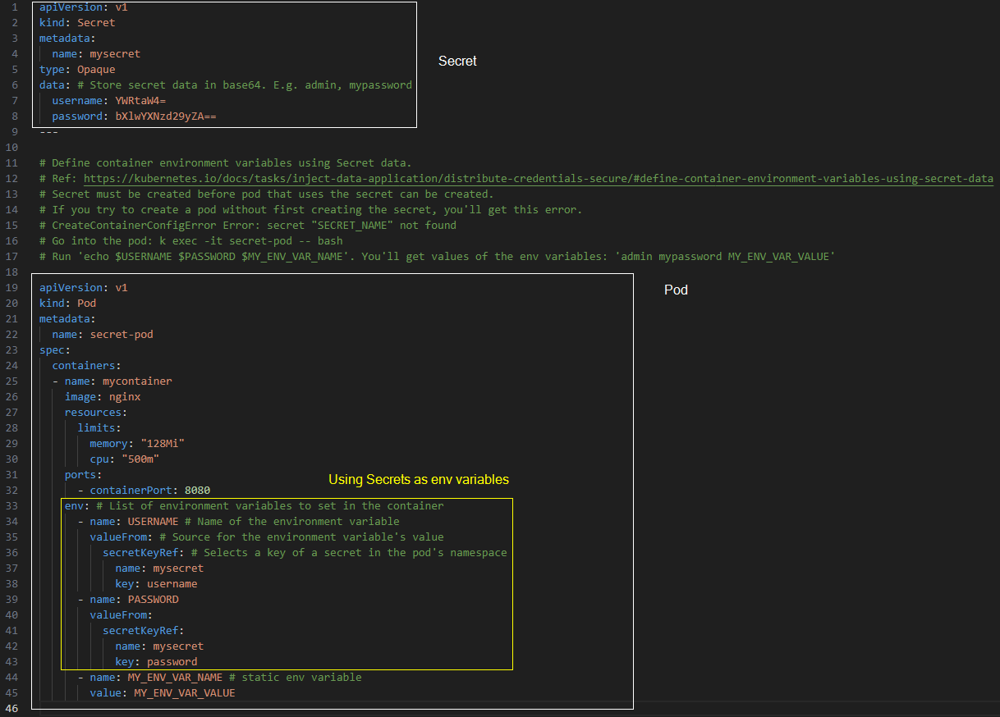

## Using Secrets as environment variables

References:  
[Secrets](https://kubernetes.io/docs/concepts/configuration/secret/)   
[Kubernetes API: Secret](https://kubernetes.io/docs/reference/kubernetes-api/config-and-storage-resources/secret-v1/)  

**Agenda**
* Background.  
* Create a Secret and a Pod that uses the Secret as container environment variables.  
* Cleanup.

> Start a Kubernetes cluster using `minikube start`.

Secrets can be mounted as data volumes or exposed as environment variables to be used by a container in a Pod.  
To use a Secret in an environment variable in a Pod, for each container in your Pod specification, add an environment variable for each Secret key that you want to use to the `env[].valueFrom.secretKeyRef` field.  

If a container already consumes a Secret in an environment variable, a Secret update will not be seen by the container unless it is restarted. There are third party solutions for triggering restarts when secrets change.

**Create Secret and Pod that uses the secret using config file**  
The manifest file used in this lab has Secret and Pod configuration in the same file separated by `---` in YAML.  

Secret:  
name=mysecret  
data has two strings _admin_ and _mypassword_ in base64.  

Pod:  
Uses Secret as env variable.  

Create the manifest. Save the following YAML file in your directory.  
File: [7-k8s-secret-env-1.yaml](yaml/7-k8s-secret-env-1.yaml)



Apply the configuration using using `kubectl apply -f YAML_FILE`.  

```console
~/learnk8s> kubectl apply -f yaml/7-k8s-secret-env-1.yaml 
secret/mysecret created
pod/secret-pod created
```

In your shell, display the contents of container environment variables.  

```console
~/learnk8s> kubectl exec -it secret-pod -- bash -c 'echo $USERNAME $PASSWORD'
admin mypassword
```

**Cleanup**  
Delete the configuration using `kubectl delete -f YAML_FILE`.

```console
~/learnk8s> kubectl delete -f yaml/7-k8s-secret-env-1.yaml 
secret "mysecret" deleted
pod "secret-pod" deleted
```