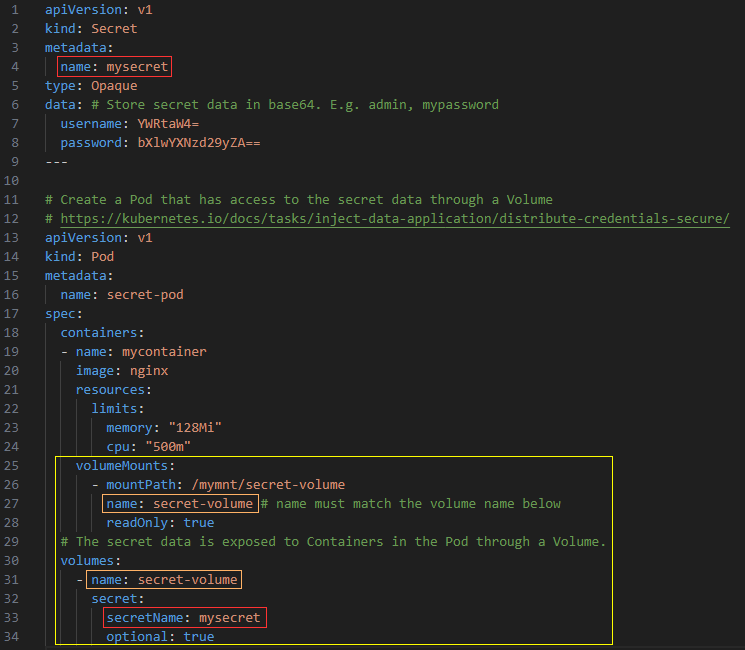
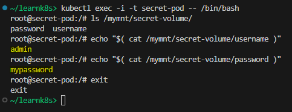
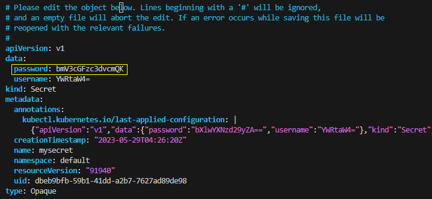

## Using Secrets as files from a Pod

References:  
[Using Secrets as files from a Pod](https://kubernetes.io/docs/concepts/configuration/secret/#using-secrets-as-files-from-a-pod)   
[Create a Pod that has access to the secret data through a Volume](https://kubernetes.io/docs/tasks/inject-data-application/distribute-credentials-secure/#create-a-pod-that-has-access-to-the-secret-data-through-a-volume)

**Agenda**
* Background.  
* Create a Secret and a Pod that uses the Secret as files in a volume mounted on the container.  
* Edit Secret and verify changes from within Pod.    
* Cleanup.

> Start a Kubernetes cluster using `minikube start`.

**Background**  
Secrets can be mounted as data volumes or exposed as environment variables to be used by a container in a Pod.  
When a volume contains data from a Secret, and that Secret is updated, Kubernetes tracks this and updates the data in the volume, using an eventually-consistent approach.

**Create Secret and Pod that uses the secret using a volume**  
The manifest file used in this lab has Secret and Pod configuration in the same file separated by `---` in YAML.  

Create a Secret containing multiple key-value pairs. For e.g.  
name: mysecret  
data: username=_admin_, password=_mypassword_ in base64.  

Pod:  
Uses Secret as a volume.  

Create the manifest. Save the following YAML file in your directory.  
File: [9-k8s-secret-volume.yaml](yaml/9-k8s-secret-volume.yaml)



Apply the configuration using using `kubectl apply -f YAML_FILE`.  

```console
~/learnk8s> kubectl apply -f yaml/9-k8s-secret-volume.yaml 
secret/mysecret created
pod/secret-pod created
```

Get a shell into the Container that is running in your Pod.  
```console
kubectl exec -i -t secret-pod -- /bin/bash
```

The secret data is exposed to the Container through a Volume mounted under `/mymnt/secret-volume`. In your shell, list the files in the `/mymnt/secret-volume` directory using `ls /mymnt/secret-volume` command:

```console
~/learnk8s> kubectl exec -i -t secret-pod -- /bin/bash
root@secret-pod:/# ls /mymnt/secret-volume/
password  username
```

Each key in the Secret `data` map becomes a file name in this directory.  
In your shell, display the contents of the `username` and `password` files.

```console
# Run this in the shell inside the container
echo "$( cat /mymnt/secret-volume/username )"
echo "$( cat /mymnt/secret-volume/password )"
```

The output is the username and password specified in the Secret.  



**Edit a secret**  

Run the command `kubectl edit secrets <secret-name>`. This opens your default editor and allows you to update the base64 encoded Secret values in the `data` field. For this lab, we will change the _password_ from _mypassword_ (bXlwYXNzd29yZA==) to _newpassword_ (bmV3cGFzc3dvcmQK).

```console
~/learnk8s> echo "newpassword" | base64
bmV3cGFzc3dvcmQK
```



```console
~/learnk8s> kubectl edit secrets mysecret
secret/mysecret edited
```

**Verify Secret change**  
Get a shell to the Pod, and verify the value of `password` file in the volume.  

```console
~/learnk8s> kubectl exec -i -t secret-pod -- /bin/bash
root@secret-pod:/# ls /mymnt/secret-volume/
password  username
root@secret-pod:/# echo "$( cat /mymnt/secret-volume/password )"
newpassword
root@secret-pod:/# exit
exit
~/learnk8s>
```

**Cleanup**  
Delete the configuration using `kubectl delete -f YAML_FILE`.

```console
~/learnk8s> kubectl delete -f yaml/9-k8s-secret-volume.yaml 
secret "mysecret" deleted
pod "secret-pod" deleted
```