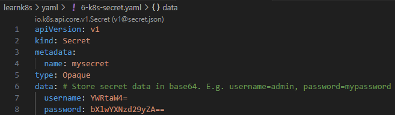

## Secrets

References:  
[Secrets](https://kubernetes.io/docs/concepts/configuration/secret/)  
[Good practices for Kubernetes Secrets](https://kubernetes.io/docs/concepts/security/secrets-good-practices/)  
[Kubernetes API: Secret](https://kubernetes.io/docs/reference/kubernetes-api/config-and-storage-resources/secret-v1/)  

**Agenda**
* Secrets overview.
* Create a Secret.
* Verify and decode the Secret.
* Cleanup.

> Start a Kubernetes cluster using `minikube start`.

**Background**  
A `Secret` object stores sensitive data such as credentials used by Pods to access services. For example, you might need a Secret to store the username and password needed to access a database.  
Secrets can be mounted as data volumes or exposed as environment variables to be used by a container in a Pod.  

**Create Secret using config file**  
This example will store two strings, _admin_ and _mypassword_, in a Secret using the `data` field. Convert the strings to base64.  

```console
~/learnk8s> echo -n 'admin' | base64
YWRtaW4=
~/learnk8s> echo -n 'mypassword' | base64
bXlwYXNzd29yZA==
```

Create the manifest. Save the following YAML file in your directory.  
File: [6-k8s-secret.yaml](yaml/6-k8s-secret.yaml)



Create the Secret using `kubectl apply`.  

```console
~/learnk8s> kubectl apply -f yaml/6-k8s-secret.yaml 
secret/mysecret created
```

**Secret verification and decoding**  

```console
~/learnk8s> kubectl get secrets
NAME       TYPE     DATA   AGE
mysecret   Opaque   2      3m49s
~/learnk8s> kubectl describe secret mysecret
Name:         mysecret
Namespace:    default
Labels:       <none>
Annotations:  <none>

Type:  Opaque

Data
====
password:  10 bytes
username:  5 bytes
```

The commands `kubectl get` and `kubectl describe` avoid showing the contents of a `Secret` by default. This is to protect the `Secret` from being exposed accidentally, or from being stored in a terminal log.

To decode the password field stored in the secret, run the following command.

```console
~/learnk8s> kubectl get secret mysecret -o jsonpath='{.data.password}' | base64 --decode
mypassword
```

**Cleanup**  
To delete a Secret, run the following command:

```console
~/learnk8s> kubectl delete secret mysecret
secret "mysecret" deleted
```