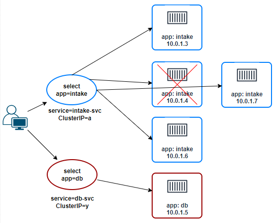

## Service

References:  
[Kubernetes API: Service](https://kubernetes.io/docs/reference/kubernetes-api/service-resources/service-v1/)  
[Kubernetes Concepts: Service](https://kubernetes.io/docs/concepts/services-networking/service/)  
[Using a Service to Expose Your App](https://kubernetes.io/docs/tutorials/kubernetes-basics/expose/expose-intro/)

**Agenda**
* Need for Service
* NodePort Service.
* Create Service (declaratively).
* Describe Service.
* Access app from outside the cluster.

> Start a Kubernetes cluster using `minikube start`.

**Need for Service**  
Services can be used to expose applications in a Kubernetes cluster.  
A Service routes traffic across a set of Pods.  
A service can target a set of Pods using a *label selector*. 

Below diagram from Kubernetes documentation shows Services and Labels.

As shown in [LAB: Deployment](k8s-lab-deployment.md), the application isn't accessible from outside the cluster.

**ClusterIP Service (default)**

Exposes the Service on an internal IP in the cluster. This type makes the Service only reachable from within the cluster.

**NodePort Service**

A NodePort Service can be used to provide external access to the Pods.  
It exposes the service on the same port of each selected Node in the cluster using NAT.  
It makes a service accessible from outside the cluster using `<NodeIP>:<NodePort>`.  

**Create Service**

Save the following YAML file in your directory.  
File: [3-nginx-service.yaml](yaml/3-nginx-service.yaml)

Create a Service using `kubectl apply -f YAML_FILE`.

**Describe Service**

Describe Service using `kubectl describe svc SERVICE_NAME`.

**Access App using Service**

Now you can use `curl localhost:30000` to access your application from outside the cluster.  

***Note:*** With minikube, `curl localhost:30000` will not work from your host machine / WSL2 Ubuntu distro. This happens because minikube creates a virtual machine (VM) and then runs your containers on it. Therefore, 'Node' in NodePort service refers to this minikube VM and not the WSL2 Ubuntu distro.  
Run `minikube ssh` to connect to the minikube VM and then access your app.

