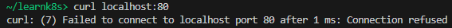
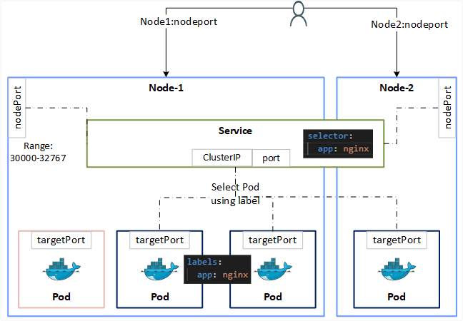
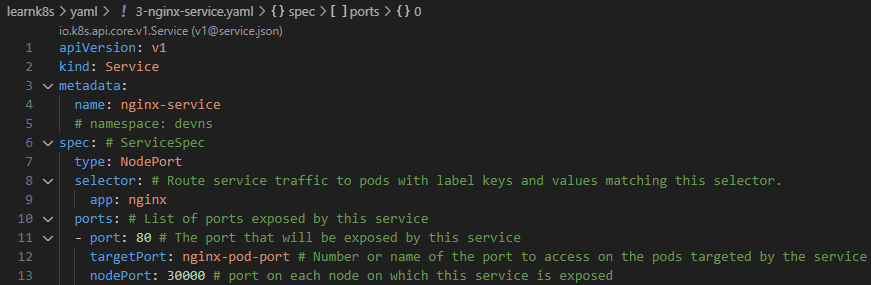
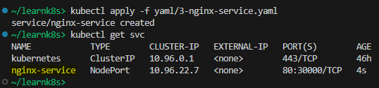
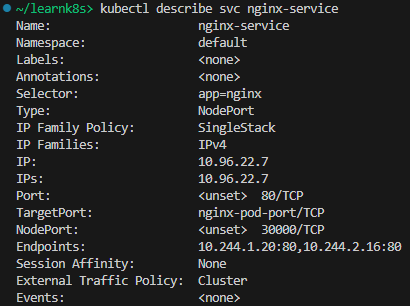
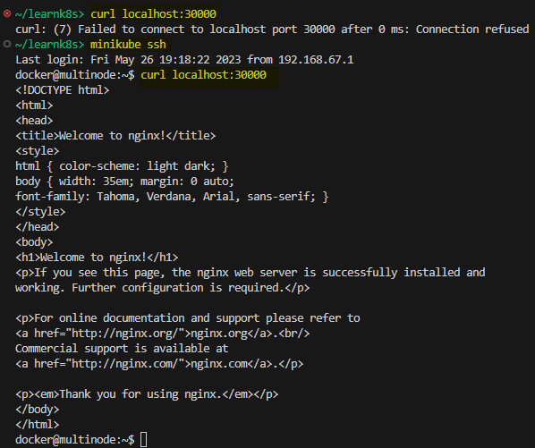

## Service

References:  
[Kubernetes API: Service](https://kubernetes.io/docs/reference/kubernetes-api/service-resources/service-v1/)  
[Kubernetes Concepts: Service](https://kubernetes.io/docs/concepts/services-networking/service/)

**Agenda**
* Need for Service
* NodePort Service.
* Create Service (declaratively).
* Describe Service.
* Access app from outside the cluster.

> Start a Kubernetes cluster using `minikube start`.

**Need for Service**  
Service is used to provide external access to your Kubernetes cluster.  
As shown in [LAB: Deployment](k8s-lab-deployment.md), the application isn't accessible from outside the cluster.

Service provides external access to the Pods.

**NodePort Service**

**Create Service**

Save the following YAML file in your directory.  
File: [3-nginx-service.yaml](yaml/3-nginx-service.yaml)

Create a Service using `kubectl apply -f YAML_FILE`.

**Describe Service**

Describe Service using `kubectl describe svc SERVICE_NAME`.

**Access App using Service**

Now you can use `curl localhost:30000` to access your application from outside the cluster.  

***Note:*** With minikube, `curl localhost:30000` will not work from your host machine / WSL2 Ubuntu distro. This happens because minikube creates a virtual machine (VM) and then runs your containers on it. Therefore, 'Node' in NodePort service refers to this minikube VM and not the WSL2 Ubuntu distro.  
Run `minikube ssh` to connect to the minikube VM and then access your app.

