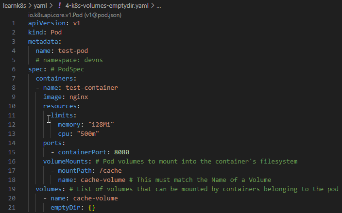
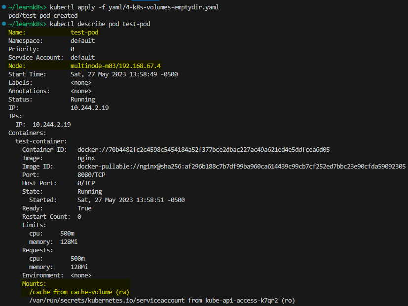
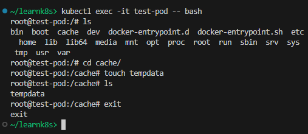
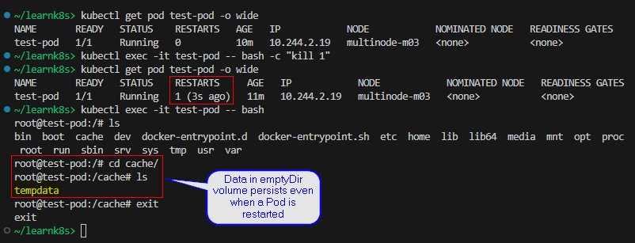

## Volumes - emptyDir

References:  
[Kubernetes Concepts: Volumes](https://kubernetes.io/docs/concepts/storage/volumes/)  
[emptyDir](https://kubernetes.io/docs/concepts/storage/volumes/#emptydir)

**Agenda**  
* Volumes background.
* Create a Pod and mount an emptyDir volume.
* Create a file in the mounted volume.
* Restart the Pod and observe contents of the emptyDir volume after Pod restart.

> Start a Kubernetes cluster using `minikube start`.

**Background**  
At its core, a volume is a directory, possibly with some data in it, which is accessible to the containers in a pod. To use a volume, specify the volumes to provide for the Pod in `.spec.volumes` and declare where to mount those volumes into containers in `.spec.containers[*].volumeMounts`.

**emptyDir - Ephemeral Volumes**  
`emptyDir` emptyDir represents a temporary directory that shares a pod's lifetime. An `emptyDir` volume is first created when a Pod is assigned to a node, and exists as long as that Pod is running on that node. The `emptyDir` volume is initially empty. When a Pod is removed from a node for any reason, the data in the `emptyDir` is deleted permanently. 

***Note:*** The data in an `emptyDir` volume is safe across container crashes.

**Create a Pod and mount an `emptyDir` volume inside the container**  
Save the following YAML file in your directory.  
File: [4-k8s-volumes-emptydir.yaml](yaml/4-k8s-volumes-emptydir.yaml)

Apply the configuration using `kubectl apply -f YAML_FILE`.

**Write something to the emptyDir volume inside the container**  
Get a shell to the running container using `kubectl exec -it test-pod -- bash`.  
Notice the `cache` directory inside the container. This is where the `emptyDir` volume is mounted as per our YAML manifest. Create a file in the cache folder.  

**Restart Pod**  
This test is to prove that the data in an `emptyDir` volume is safe across container crashes. Refer https://ss64.com/bash/ for Linux command line reference.

**Cleanup**  
Run `kubectl delete -f YAML_FILE`