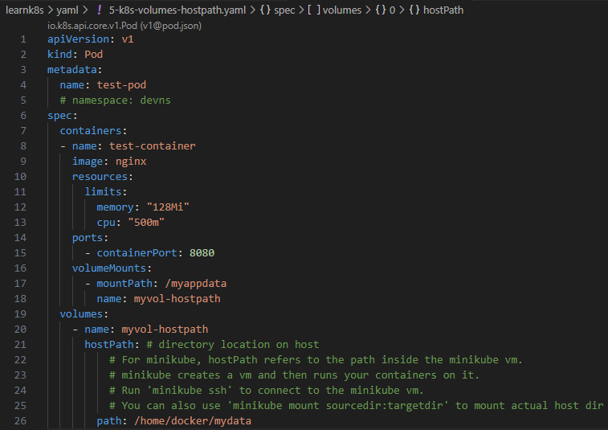
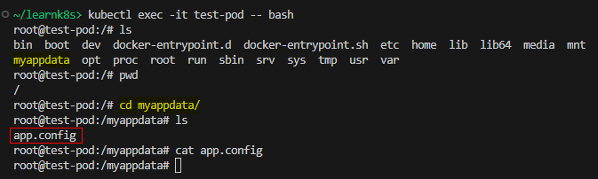
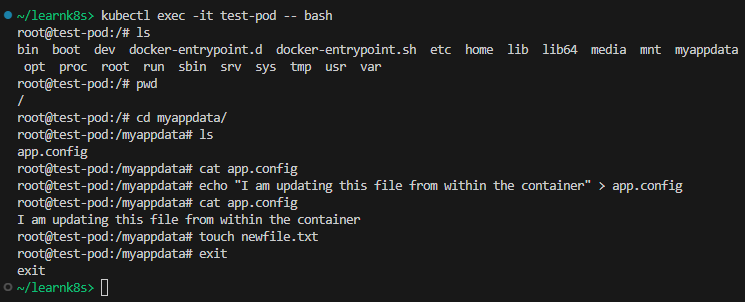
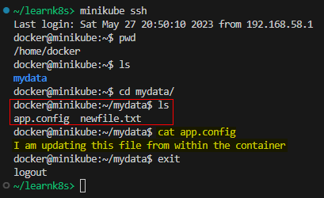
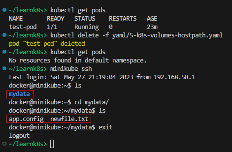
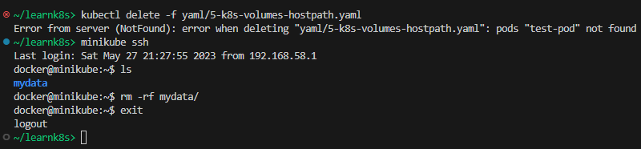

## Volumes - hostPath

References:  
[Kubernetes Concepts: Volumes](https://kubernetes.io/docs/concepts/storage/volumes/)  
[hostPath](https://kubernetes.io/docs/concepts/storage/volumes/#hostpath)  
[Persistent Volumes](https://kubernetes.io/docs/concepts/storage/persistent-volumes/)

> ***Note**: for single node testing only; WILL NOT WORK in a multi-node cluster.*  
>
> **Warning**:  
> HostPath volumes present many security risks, and it is a best practice to avoid the use of HostPaths when possible. When a HostPath volume must be used, it should be scoped to only the required file or directory, and mounted as ReadOnly.

**Agenda**  
* Volumes background.
* Create a directory on host that will be mounted into the container.
* Create a Pod and mount a `hostPath` volume.
* Perform CRUD operations on `hostPath` from within the container, and from the host.
* Delete the Pod and observe contents of the `hostPath` volume after Pod deletion.

> Start a Kubernetes cluster using `minikube start`.  

**Background**  
At its core, a volume is a directory, possibly with some data in it, which is accessible to the containers in a pod. To use a volume, specify the volumes to provide for the Pod in `.spec.volumes` and declare where to mount those volumes into containers in `.spec.containers[*].volumeMounts`.  

**hostPath**  
A `hostPath` volume mounts a file or directory from the host node's filesystem into your Pod. `hostPath` represents a pre-existing file or directory on the host machine that is directly exposed to the container. This is generally used for system agents or other privileged things that are allowed to see the host machine. Most containers will NOT need this.  

**Create a directory on host that will be mounted inside the Pod**  
*Minikube-specific note*  
Minikube creates a vm and then runs your containers on it.  
Run `minikube ssh` to connect to the minikube vm.  
Once inside this vm, create a folder `mydata` that will be mounted into the container.  
Create a file `app.config` inside this folder.  

**Create a Pod and mount a `hostPath` volume inside the container**  
Save the following YAML file in your directory.  
File: [5-k8s-volumes-hostpath.yaml](yaml/5-k8s-volumes-hostpath.yaml)

Apply the configuration using `kubectl apply -f YAML_FILE`.

**hostPath data verification - from container**  
Get a shell to the running container using `kubectl exec -it test-pod -- bash`.  
Notice the `/myappdata` directory inside the container. This is where the `hostPath` volume is mounted as per our YAML manifest.  
Notice the `app.config` file that was created in the earlier step.  

**hostPath data update - from container**  
From within the container, edit the `app.config` file and also create a new file called `newfile.txt`.  
Exit out of container.  

**hostPath data verification - from host**  
Verify the changes from `hostPath` on the host.  

**Delete Pod and verify hostPath on host**  

**Cleanup**  
Run `kubectl delete -f YAML_FILE`.  
Delete `mydata` from host.  

