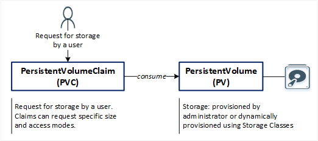
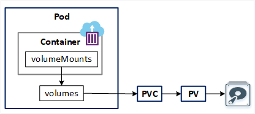

## Persistent Volumes

References:  
[Persistent Volumes](https://kubernetes.io/docs/concepts/storage/persistent-volumes/)  
[Configure a Pod to Use a PersistentVolume for Storage](https://kubernetes.io/docs/tasks/configure-pod-container/configure-persistent-volume-storage/)  
[Kubernetes 1.14: Local Persistent Volumes GA](https://kubernetes.io/blog/2019/04/04/kubernetes-1.14-local-persistent-volumes-ga/)  
[Kubernetes API: PersistentVolume](https://kubernetes.io/docs/reference/kubernetes-api/config-and-storage-resources/persistent-volume-v1/)  
[Kubernetes API: PersistentVolumeClaim](https://kubernetes.io/docs/reference/kubernetes-api/config-and-storage-resources/persistent-volume-claim-v1/)

**Agenda**  
* PersistentVolume (PV) and PersistentVolumeClaim (PVC) introduction.
* Local Persistent Volume. 
* Create local StorageClass, PV, PVC and Pod that uses PVC.

> Start a Kubernetes cluster using `minikube start`.  

**PersistentVolume (PV) and PersistentVolumeClaim (PVC)**  

  

A *PersistentVolume* (PV) is a piece of storage in the cluster that has been provisioned by an administrator or dynamically provisioned using [Storage Classes](https://kubernetes.io/docs/concepts/storage/storage-classes/).  

A *PersistentVolumeClaim* (PVC) is a request for storage by a user. Pods consume node resources and PVCs consume PV resources. Claims can request specific size and access modes (e.g., they can be mounted ReadWriteOnce, ReadOnlyMany or ReadWriteMany, see [AccessModes](https://kubernetes.io/docs/concepts/storage/persistent-volumes/#access-modes)).  



**Local Persistent Volume**  
A local persistent volume represents a local disk directly-attached to a single Kubernetes Node.  

**Local Persistent Volume vs HostPath Volume**  
With Local Persistent Volumes, the Kubernetes scheduler ensures that a pod using a Local Persistent Volume is always scheduled to the same node. With HostPath volumes, a pod referencing a HostPath volume may be moved by the scheduler to a different node resulting in data loss.  

With HostPath volumes, a pod referencing a HostPath volume may be moved by the scheduler to a different node resulting in data loss.  

While HostPath volumes may be referenced via a Persistent Volume Claim (PVC) or directly inline in a pod definition, Local Persistent Volumes can only be referenced via a PVC.  

**Create local directory with index.html on the Node**  
Open a shell to the single Node in your cluster. For Minikube, you can open a shell to your Node by entering `minikube ssh`.  
Create a `/localstore/data` directory. This will be used in the PV.  
In the `/localstore/data` directory, create an `index.html` file.  

```console
~/learnk8s> minikube ssh
Last login: Tue May 30 21:10:33 2023 from 192.168.58.1
docker@minikube:~$ sudo mkdir -p /localstore/data
docker@minikube:~$ sudo chmod 777 /localstore/data
docker@minikube:/localstore/data$ echo "Hello from local K8s volume" > /localstore/data/index.html
docker@minikube:/localstore/data$ cat /localstore/data/index.html 
Hello from local K8s volume
docker@minikube:~$ exit
logout
```

**Create StorageClass**  
Save the following YAML file in your directory.  
File: [k8s-volumes-storageclass-local.yaml](yaml/k8s-volumes-storageclass-local.yaml)

```yaml
apiVersion: storage.k8s.io/v1
kind: StorageClass
metadata:
  name: local-storage
provisioner: kubernetes.io/no-provisioner
volumeBindingMode: WaitForFirstConsumer
```

Create the StorageClass using `kubectl apply -f YAML_FILE`.  

```console
~/learnk8s> kubectl get storageclass
NAME                 PROVISIONER                    RECLAIMPOLICY   VOLUMEBINDINGMODE      ALLOWVOLUMEEXPANSION   AGE
local-storage        kubernetes.io/no-provisioner   Delete          WaitForFirstConsumer   false                  26s
standard (default)   k8s.io/minikube-hostpath       Delete          Immediate              false                  3d
```

**Create a PersistentVolume**  
Save the following YAML file in your directory.  
File: [k8s-volumes-pv-local.yaml](yaml/k8s-volumes-pv-local.yaml)

```yaml
apiVersion: v1
kind: PersistentVolume
metadata:
  name: demo-pv
  labels:
    type: demo-pv
spec:
  storageClassName: local-storage # name of StorageClass to which this pv belongs
  capacity:
    storage: 1Gi
  accessModes:
    - ReadWriteOnce
  local: # directly-attached storage with node affinity
    path: /localstore/data # full path to the volume on the node
  nodeAffinity:
    required:
      nodeSelectorTerms:
        - matchExpressions: # kubectl get nodes --show-labels
            - key: kubernetes.io/hostname
              operator: In
              values:
                - "minikube"
```

Create the PV using `kubectl apply -f YAML_FILE`.  

```console
~/learnk8s> kubectl apply -f yaml/k8s-volumes-pv-local.yaml 
persistentvolume/demo-pv created
~/learnk8s> kubectl get pv demo-pv
NAME      CAPACITY   ACCESS MODES   RECLAIM POLICY   STATUS      CLAIM   STORAGECLASS    REASON   AGE
demo-pv   1Gi        RWO            Retain           Available           local-storage            18s
~/learnk8s>
```

The output shows that the PersistentVolume has a `STATUS` of `Available`. This means it has not yet been bound to a PersistentVolumeClaim.

**Create a PersistentVolumeClaim**  
Save the following YAML file in your directory.  
File: [k8s-volumes-pvc-local.yaml](yaml/k8s-volumes-pvc-local.yaml)

```yaml
apiVersion: v1
kind: PersistentVolumeClaim
metadata:
  name: demo-pvc
spec:
  resources: # minimum resources the volume should have
    requests: # minimum amount of compute resources required
      storage: 1Gi
  accessModes:
    - ReadWriteOnce
  storageClassName: local-storage # StorageClass required by the claim
```

Create the PVC using `kubectl apply -f YAML_FILE`.  

```console
~/learnk8s> kubectl apply -f yaml/k8s-volumes-pvc-local.yaml
persistentvolumeclaim/demo-pvc created
~/learnk8s> kubectl get pvc
NAME       STATUS    VOLUME   CAPACITY   ACCESS MODES   STORAGECLASS    AGE
demo-pvc   Pending                                      local-storage   5s
```

The output shows that the PersistentVolumeClaim has a `STATUS` of `Pending`. We can run `kubectl describe` to see why.  
```console
~/learnk8s> kubectl describe pvc demo-pvc
Name:          demo-pvc
Namespace:     default
StorageClass:  local-storage
Status:        Pending
Volume:        
Labels:        <none>
Annotations:   <none>
Finalizers:    [kubernetes.io/pvc-protection]
Capacity:      
Access Modes:  
VolumeMode:    Filesystem
Used By:       <none>
Events:
  Type    Reason                Age                From                         Message
  ----    ------                ----               ----                         -------
  Normal  WaitForFirstConsumer  13s (x6 over 84s)  persistentvolume-controller  waiting for first consumer to be created before binding
  ```

**Create a Pod**  
Create a Pod that uses your PersistentVolumeClaim as a volume.  
Save the following YAML file in your directory.  
Notice that the Pod's configuration file specifies a PersistentVolumeClaim, but it does not specify a PersistentVolume. From the Pod's point of view, the claim is a volume.  
File: [k8s-volumes-pod-pv.yaml](yaml/k8s-volumes-pod-pv.yaml)

```yaml
apiVersion: v1
kind: Pod
metadata:
  name: demo-pv-pod
  # namespace: devns
spec: # PodSpec
  volumes: # List of volumes that can be mounted by containers belonging to the pod
    - name: pv-storage
      persistentVolumeClaim:
        claimName: demo-pvc
  containers:
  - name: demo-pv-container
    image: nginx
    resources:
      limits:
        memory: "128Mi"
        cpu: "500m"
    ports:
      - containerPort: 80
    volumeMounts: # Pod volumes to mount into the container's filesystem
      - mountPath: /usr/share/nginx/html
        name: pv-storage # This must match the Name of a Volume
```

Create the Pod using `kubectl apply -f YAML_FILE`.  

```console
~/learnk8s> kubectl apply -f yaml/k8s-volumes-pod-pv.yaml 
pod/demo-pv-pod created
~/learnk8s> kubectl get pod demo-pv-pod
NAME          READY   STATUS    RESTARTS   AGE
demo-pv-pod   1/1     Running   0          7s
```
Look at the PV and PVC.

```console
~/learnk8s> kubectl get pvc
NAME       STATUS   VOLUME    CAPACITY   ACCESS MODES   STORAGECLASS    AGE
demo-pvc   Bound    demo-pv   1Gi        RWO            local-storage   7m4s
~/learnk8s> kubectl get pv
NAME      CAPACITY   ACCESS MODES   RECLAIM POLICY   STATUS   CLAIM              STORAGECLASS    REASON   AGE
demo-pv   1Gi        RWO            Retain           Bound    default/demo-pvc   local-storage            10m
```

The output shows that the PVC is now bound to the PV.

**Verification**  
Get a shell to the container running in your Pod. In your shell, verify that nginx is serving the `index.html` file from the local volume:  

```console
~/learnk8s> kubectl apply -f yaml/k8s-volumes-pod-pv.yaml 
pod/demo-pv-pod created
~/learnk8s> kubectl get pod demo-pv-pod
NAME          READY   STATUS    RESTARTS   AGE
demo-pv-pod   1/1     Running   0          32s
~/learnk8s> kubectl exec -it demo-pv-pod -- /bin/bash
root@demo-pv-pod:/# curl localhost
Hello from local K8s volume
root@demo-pv-pod:/# exit
exit
~/learnk8s>
```

**Cleanup**  
Delete the Pod, PVC, PV, StorageClass.

```console
~/learnk8s> kubectl delete pod demo-pv-pod
pod "demo-pv-pod" deleted
~/learnk8s> kubectl delete pvs demo-pvc
error: the server doesn't have a resource type "pvs"
~/learnk8s> kubectl delete pvc demo-pvc
persistentvolumeclaim "demo-pvc" deleted
~/learnk8s> kubectl delete pv demo-pv
persistentvolume "demo-pv" deleted
~/learnk8s> kubectl delete storageclass local-storage
storageclass.storage.k8s.io "local-storage" deleted
```

In the shell on your Node, remove the file and directory that you created.  

```console
~/learnk8s> minikube ssh
Last login: Tue May 30 21:51:32 2023 from 192.168.58.1
docker@minikube:~$
docker@minikube:/$ sudo rm -rf /localstore/
docker@minikube:~$ exit
logout
```
